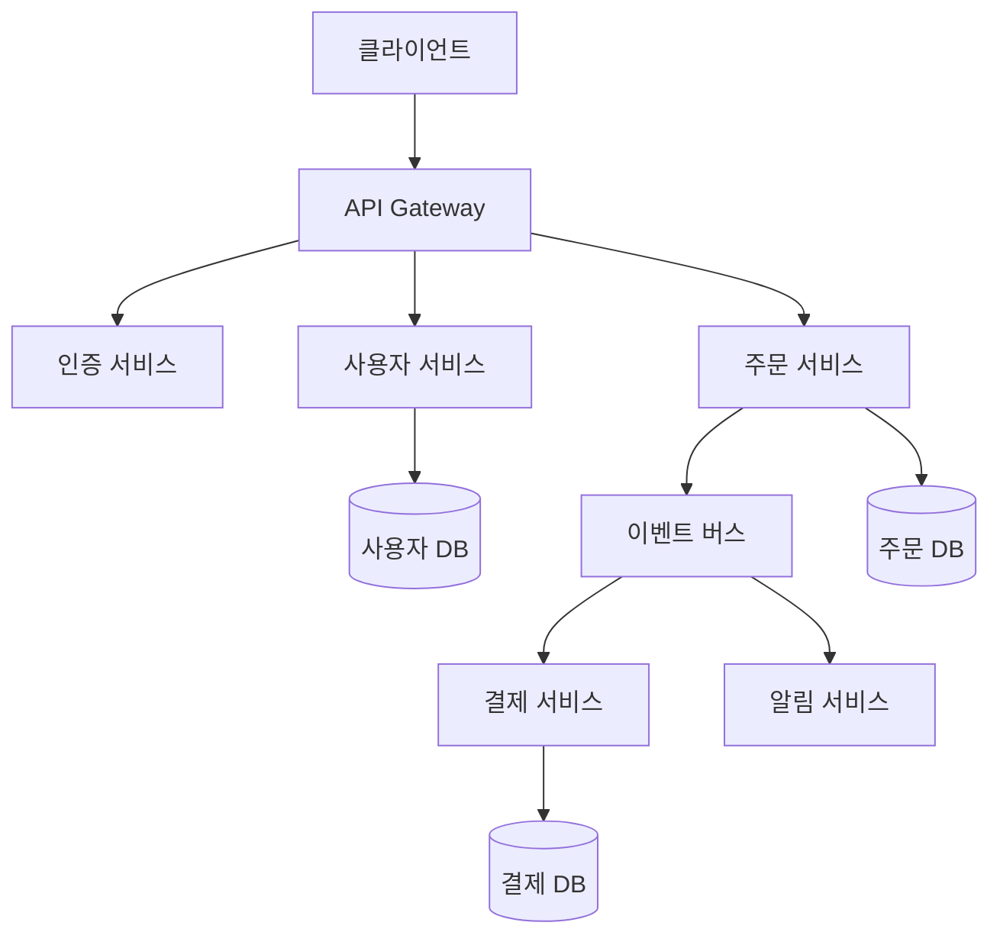

# 클라우드 아키텍처패턴선정 가이드

## 목적

마이크로서비스 기반 클라우드 시스템을 위한 아키텍처 패턴 선정 방법론을 제공함. 체계적인 분석과 정량적 평가를 통해 최적의 패턴을 선정할 수 있음.

## 입력 (이전 단계 산출물)

| 산출물 | 파일 경로 | 활용 방법 |
|--------|----------|----------|
| 유저스토리 | `docs/plan/design/userstory.md` | 기능적/비기능적 요구사항 분석 |
| 이벤트 스토밍 | `docs/plan/think/es/*.puml` | 서비스 경계 확인 |
| 핵심 솔루션 | `docs/plan/think/핵심솔루션.md` | 기술적 도전과제 식별 |
| UI/UX 설계서 | `docs/plan/design/uiux/uiux.md` | 사용자 인터랙션 패턴 파악 |
| 클라우드 디자인 패턴 개요 | `resources/references/Cloud Design Patterns(개요).md` | 42개 패턴 후보 풀 참조 |

## 출력 (이 단계 산출물)

| 산출물 | 파일 경로 |
|--------|----------|
| 아키텍처 패턴 선정 설계서 | `docs/design/architecture.md` |

## 방법론

### 1. 요구사항 분석

#### 1.1 유저스토리 분석
각 서비스별로 기능적/비기능적 요구사항을 명확히 도출합니다.

**기능적 요구사항**:
- 각 유저스토리에서 요구하는 핵심 기능
- 서비스 간 데이터 교환 요구사항
- 비즈니스 로직의 복잡도와 특성

**비기능적 요구사항**:
- 성능 요구사항 (응답시간, 처리량)
- 가용성 및 신뢰성 요구사항
- 확장성 및 유지보수성 요구사항
- 보안 및 컴플라이언스 요구사항

#### 1.2 이벤트 스토밍 분석
이벤트 스토밍 결과에서 아키텍처 패턴 선정에 필요한 핵심 정보를 추출합니다.

**분석 항목**:
- 서비스 경계 (Bounded Context): 마이크로서비스 분리 단위 확인
- 이벤트 흐름: 서비스 간 이벤트 발행/구독 관계 → Event Sourcing, CQRS 필요성 판단
- 커맨드/쿼리 패턴: 읽기/쓰기 비율, 분리 필요성
- 분산 트랜잭션: 여러 서비스에 걸친 트랜잭션 → Saga 패턴 필요성 판단
- 동기/비동기 통신: 서비스 간 통신 방식 결정

#### 1.3 통합 분석
유저스토리, 이벤트 스토밍, 핵심 솔루션, UI/UX 설계서를 연계하여 **기술적 도전과제를 식별**합니다.

**도전과제 식별**:
- 핵심 솔루션에서 식별된 기술적 과제 (AI 연동, 외부 API 등)
- 복잡한 비즈니스 트랜잭션 (이벤트 스토밍 기반)
- 대용량 데이터 처리 및 실시간 처리 요구사항
- 외부 시스템 연동 복잡성
- 서비스 간 의존성 관리
- UI/UX에서 파악된 동기/비동기 처리 필요성

#### 1.4 패턴 후보 스크리닝
`resources/references/Cloud Design Patterns(개요).md`의 42개 패턴을 8개 카테고리별로 도전과제와 매핑하여 후보를 축소합니다.

**카테고리-도전과제 매핑표**:

| 카테고리 | 관련 도전과제 유형 | 대표 패턴 예시 |
|----------|-------------------|---------------|
| DB 성능 개선 | 대용량 데이터, 읽기/쓰기 분리 | CQRS, Database Sharding |
| 읽기 최적화 | 높은 읽기 비율, 응답시간 요구 | Cache-Aside, Materialized View |
| 핵심 업무 집중 | 비즈니스 로직 복잡도, 외부 위임 | Strangler Fig, Anti-Corruption Layer |
| 안정적 현대화 | 레거시 연동, 점진적 전환 | Strangler Fig, Sidecar |
| 효율적 분산 처리 | 분산 트랜잭션, 이벤트 기반 통신 | Saga, Event Sourcing, Choreography |
| 안정성 | 장애 전파 방지, 가용성 확보 | Circuit Breaker, Bulkhead, Retry |
| 보안 | 인증/인가, 데이터 보호 | Gatekeeper, Valet Key |
| 운영 | 배포, 모니터링, 구성 관리 | Sidecar, Ambassador, External Configuration |

**스크리닝 프로세스**:
1. 식별된 도전과제를 8개 카테고리에 매핑
2. 관련 없는 카테고리 제외 (예: 레거시 없으면 "안정적 현대화" 제외)
3. 관련 카테고리 내 패턴만 후보 풀로 선별 (42개 → 10~15개)
4. 후보 패턴 목록을 정리하여 평가 단계로 전달

### 2. 패턴 선정

#### 2.1 평가 기준
다음 6가지 기준으로 각 패턴을 정량적으로 평가합니다.

| 기준 | 기본 가중치 | 평가 내용 |
|------|-----------|-----------|
| **기능 적합성** | 30% | 요구사항을 직접 해결하는 능력 |
| **성능 효과** | 20% | 응답시간 및 처리량 개선 효과 |
| **운영 용이성** | 15% | 구현 및 운영의 용이성 (점수가 높을수록 운영이 쉬움) |
| **확장성** | 15% | 미래 요구사항에 대한 대응력 |
| **보안 적합성** | 10% | 인증/인가, 데이터 보호, 보안 위협 대응력 |
| **비용 효율성** | 10% | 개발/운영 비용 대비 효과(ROI) |

#### 2.2 프로젝트 프로파일별 가중치 조정
프로젝트 특성에 따라 기본 가중치를 조정합니다.

| 프로파일 | 기능 적합성 | 성능 효과 | 운영 용이성 | 확장성 | 보안 적합성 | 비용 효율성 |
|----------|:---:|:---:|:---:|:---:|:---:|:---:|
| **MVP/스타트업** | 35% | 10% | 25% | 5% | 10% | 15% |
| **성장기 서비스** | 25% | 25% | 15% | 15% | 10% | 10% |
| **엔터프라이즈** | 20% | 20% | 10% | 15% | 25% | 10% |
| **데이터 집약형** | 25% | 30% | 10% | 20% | 5% | 10% |

프로젝트에 적합한 프로파일을 선택하거나, 기본 가중치를 사용합니다.

#### 2.3 채점 rubric
**평가 척도**: 1-10점 (10점이 가장 우수)

| 점수 구간 | 등급 | 기준 |
|:---------:|:----:|------|
| 9-10 | 탁월 | 해당 기준을 완벽히 충족하며 추가 가치를 제공 |
| 7-8 | 우수 | 해당 기준을 충분히 충족하며 부분적 강점 보유 |
| 5-6 | 보통 | 기본 요구사항을 충족하나 개선 여지 존재 |
| 3-4 | 미흡 | 부분적으로만 충족하며 보완 조치 필요 |
| 1-2 | 부적합 | 거의 충족하지 못하며 심각한 제약 존재 |

**기준별 채점 지침**:

| 기준 | 9-10점 | 5-6점 | 1-2점 |
|------|--------|-------|-------|
| 기능 적합성 | 핵심 요구사항 100% 해결 | 주요 기능은 해결하나 부가 기능 미흡 | 핵심 기능 해결 불가 |
| 성능 효과 | 응답시간 50%+ 개선 예상 | 10~30% 개선 예상 | 성능 개선 효과 없음 |
| 운영 용이성 | 표준 도구로 즉시 운영 가능 | 일부 커스텀 운영 도구 필요 | 전문 인력 없이 운영 불가 |
| 확장성 | 수평 확장 자유로움 | 확장 가능하나 설정 변경 필요 | 수직 확장만 가능 |
| 보안 적합성 | 보안 요구사항 완벽 충족 | 기본 보안은 충족, 고급 기능 부족 | 보안 취약점 노출 가능 |
| 비용 효율성 | 기존 대비 비용 절감 | 추가 비용 소폭 발생 | 비용 대비 효과 미미 |

#### 2.4 정량적 평가

**패턴별 평가 매트릭스 예시** (기본 가중치 적용):

| 패턴 | 기능 적합성<br/>(30%) | 성능 효과<br/>(20%) | 운영 용이성<br/>(15%) | 확장성<br/>(15%) | 보안 적합성<br/>(10%) | 비용 효율성<br/>(10%) | **총점** |
|------|:---:|:---:|:---:|:---:|:---:|:---:|:---:|
| API Gateway | 8×0.30=2.4 | 7×0.20=1.4 | 8×0.15=1.2 | 9×0.15=1.35 | 7×0.10=0.7 | 7×0.10=0.7 | **7.75** |
| CQRS | 9×0.30=2.7 | 9×0.20=1.8 | 5×0.15=0.75 | 8×0.15=1.2 | 6×0.10=0.6 | 6×0.10=0.6 | **7.65** |
| Circuit Breaker | 6×0.30=1.8 | 7×0.20=1.4 | 9×0.15=1.35 | 7×0.15=1.05 | 8×0.10=0.8 | 8×0.10=0.8 | **7.20** |

#### 2.5 패턴 조합 검증
개별 평가 후, 선정된 패턴들의 조합 적합성을 검증합니다.

**시너지 조합** (함께 사용 시 효과 증대):

| 조합 | 시너지 효과 |
|------|------------|
| CQRS + Event Sourcing | 읽기/쓰기 분리와 이벤트 이력이 상호 보완 |
| API Gateway + Circuit Breaker | 진입점 통합과 장애 격리가 시너지 |
| Saga + Event Sourcing | 분산 트랜잭션 추적과 이벤트 이력이 상호 지원 |
| Cache-Aside + CQRS | 읽기 최적화 전략이 상호 강화 |

**충돌 조합** (함께 사용 시 복잡도 급증 또는 충돌):

| 조합 | 충돌 원인 | 대응 방안 |
|------|----------|----------|
| CQRS + 강한 일관성 요구 | 읽기/쓰기 분리 시 최종 일관성만 보장 | 일관성 요구 수준 재검토 |
| Event Sourcing + 빈번한 스키마 변경 | 이벤트 스키마 버전 관리 복잡 | 스키마 진화 전략 수립 |
| Saga + 동기식 API Gateway | 장기 실행 트랜잭션이 게이트웨이 타임아웃 유발 | 비동기 통신으로 전환 |

**검증 절차**:
1. 선정된 패턴 목록에서 시너지/충돌 조합 식별
2. 충돌 조합이 있으면 대응 방안을 적용하거나 패턴 교체
3. 최종 패턴 조합의 전체 아키텍처 적합성 확인

#### 2.6 트레이드오프 분석
선정된 각 패턴의 장점과 단점을 명시적으로 분석합니다.

**트레이드오프 분석 예시**:

| 패턴 | 얻는 것 (Gains) | 잃는 것 (Costs) | 수용 근거 |
|------|----------------|----------------|----------|
| CQRS | 읽기/쓰기 독립 확장, 쿼리 최적화 | 최종 일관성, 구현 복잡도 증가 | 읽기 비율 80%+로 성능 이점이 복잡도 비용 상회 |
| Event Sourcing | 완전한 감사 추적, 이벤트 리플레이 | 스토리지 증가, 스키마 진화 어려움 | 비즈니스 감사 요구사항 필수 충족 |
| Circuit Breaker | 장애 전파 방지, 시스템 안정성 | 일시적 기능 저하, 복잡한 상태 관리 | 외부 API 의존도 높아 장애 격리 필수 |

#### 2.7 단계별 적용 로드맵
MVP → 확장 → 고도화 3단계로 구분하여 점진적 적용 계획을 수립합니다.

**Phase 1: MVP (Minimum Viable Product)**
- 핵심 비즈니스 기능 중심
- 단순하고 안정적인 패턴 우선
- 빠른 출시를 위한 최소 기능

**Phase 2: 확장 (Scale-up)**
- 사용자 증가에 따른 성능 최적화
- 고급 패턴 도입
- 모니터링 및 운영 자동화

**Phase 3: 고도화 (Advanced)**
- 복잡한 비즈니스 요구사항 대응
- 최신 기술 및 패턴 적용
- 글로벌 확장 대비

### 3. 문서 작성

#### 3.1 구조화된 작성 순서
1. **요구사항 분석 결과**
2. **패턴 후보 스크리닝** (카테고리-도전과제 매핑)
3. **패턴 평가** (평가 매트릭스 + 채점 rubric)
4. **패턴 조합 검증** (시너지/충돌 분석)
5. **트레이드오프 분석**
6. **적용 설계** (Mermaid 다이어그램)
7. **구현 계획** (Phase별 로드맵)

#### 3.2 Mermaid 다이어그램 작성
서비스 아키텍처와 패턴 적용을 시각적으로 표현합니다.



#### 3.3 실용적 내용 포함
- **코드 예시**: 패턴 구현을 위한 구체적인 코드 스니펫
- **구현 시 고려사항**: 실제 개발 시 주의할 점
- **기대 효과**: 정량적 성과 지표 (응답시간 개선, 처리량 증가 등)

## 출력 형식

```markdown
# 아키텍처 패턴 선정 설계서

## 요구사항 분석 결과
### 기능적/비기능적 요구사항 상세 분석
{분석 내용}

### 기술적 도전과제 식별
{도전과제 목록}

## 패턴 후보 스크리닝
### 카테고리-도전과제 매핑
| 도전과제 | 관련 카테고리 | 후보 패턴 |
|----------|-------------|----------|
| {과제1} | {카테고리} | {패턴 목록} |

### 스크리닝 결과
- 후보 패턴 수: 42개 → {N}개
- 제외된 카테고리: {카테고리 목록}

## 패턴 선정 매트릭스 (평가표)
### 프로젝트 프로파일: {선택된 프로파일}
### 적용 가중치: {가중치 배분}

| 패턴 | 기능 적합성 | 성능 효과 | 운영 용이성 | 확장성 | 보안 적합성 | 비용 효율성 | 총점 |
|------|:---:|:---:|:---:|:---:|:---:|:---:|:---:|
| {패턴1} | {점수} | {점수} | {점수} | {점수} | {점수} | {점수} | {총점} |

### 선정 근거 및 이유
{선정 이유}

## 패턴 조합 검증
### 시너지 분석
{시너지 조합과 효과}

### 충돌 분석
{충돌 조합과 대응 방안}

## 트레이드오프 분석
| 패턴 | 얻는 것 | 잃는 것 | 수용 근거 |
|------|---------|---------|----------|
| {패턴1} | {장점} | {단점} | {근거} |

## 서비스별 패턴 적용 매핑
| 서비스 | 적용 패턴 | 적용 이유 | 관련 유저스토리 |
|--------|----------|----------|---------------|
| {서비스1} | {패턴 목록} | {이유} | {US-XXX} |

## 서비스별 패턴 적용 설계 (Mermaid)
{전체 아키텍처 구조 다이어그램}

## Phase별 구현 로드맵
### Phase 1: MVP
{단계별 적용 계획}

### Phase 2: 확장
{단계별 적용 계획}

### Phase 3: 고도화
{단계별 적용 계획}

## 기대 효과 및 검증 계획
| 지표 | 현재 (예상) | 목표 | 검증 방법 |
|------|-----------|------|----------|
| 응답시간 | {현재} | {목표} | {검증 방법} |
| 처리량 | {현재} | {목표} | {검증 방법} |
| 가용성 | {현재} | {목표} | {검증 방법} |
```

## 품질 기준

### 완료 체크리스트
- [ ] 42개 패턴에서 카테고리-도전과제 매핑으로 후보를 스크리닝했는가
- [ ] 프로젝트 프로파일에 맞는 가중치를 적용했는가
- [ ] 채점 rubric에 따라 일관된 기준으로 점수를 부여했는가
- [ ] 정량적 평가 매트릭스를 포함했는가
- [ ] 선정 패턴 간 조합 검증(시너지/충돌)을 수행했는가
- [ ] 각 패턴의 트레이드오프를 명시했는가
- [ ] 서비스별 패턴 적용 매핑 테이블을 포함했는가
- [ ] 각 유저스토리가 어떤 패턴으로 해결되는지 명시했는가
- [ ] Mermaid 다이어그램으로 시각화했는가
- [ ] 패턴 간 상호작용과 통합 아키텍처를 표현했는가
- [ ] 구현 우선순위와 단계별 목표가 명확한가
- [ ] 기대 효과에 검증 방법을 포함했는가

## 주의사항

- **객관적 평가**: 채점 rubric을 활용하여 일관된 기준으로 평가
- **스크리닝 우선**: 42개 전체를 평가하지 말고, 카테고리 매핑으로 후보를 먼저 축소
- **조합 검증**: 개별 패턴뿐 아니라 패턴 조합의 시너지와 충돌을 반드시 확인
- **현실성**: 팀의 기술 수준과 프로젝트 일정을 고려한 실현 가능한 패턴 선정
- **트레이드오프 투명성**: 각 패턴의 장단점과 수용 근거를 명확히 문서화
- **비용 효율성**: 과도한 엔지니어링 지양, 비즈니스 가치 중심 선정
- **문서화**: 선정 과정과 근거를 명확히 문서화하여 후속 의사결정 지원
- 설계 공통 원칙: `resources/guides/design/common-principles.md` 준수
