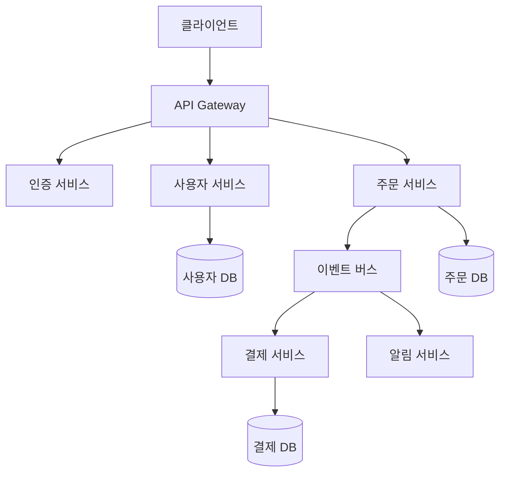

# 클라우드 아키텍처패턴선정 가이드

## 개요
이 가이드는 마이크로서비스 기반 클라우드 시스템을 위한 아키텍처 패턴 선정 방법론을 제공합니다. 체계적인 분석과 정량적 평가를 통해 최적의 패턴을 선정할 수 있습니다.

## 1. 요구사항 분석

### 1.1 유저스토리 분석
각 서비스별로 기능적/비기능적 요구사항을 명확히 도출합니다.

**기능적 요구사항**:
- 각 유저스토리에서 요구하는 핵심 기능
- 서비스 간 데이터 교환 요구사항
- 비즈니스 로직의 복잡도와 특성

**비기능적 요구사항**:
- 성능 요구사항 (응답시간, 처리량)
- 가용성 및 신뢰성 요구사항
- 확장성 및 유지보수성 요구사항
- 보안 및 컴플라이언스 요구사항

### 1.2 UI/UX설계 분석
Wireframe을 통해 사용자 인터랙션 패턴과 데이터 플로우를 파악합니다.

**분석 항목**:
- 사용자 인터랙션 패턴 (동기/비동기 처리 필요성)
- 데이터 조회/변경 패턴
- 화면 간 전환 흐름
- 실시간 업데이트 요구사항

### 1.3 통합 분석
유저스토리와 UI/UX 설계를 연계하여 **기술적 도전과제를 식별**합니다.

**도전과제 식별**:
- 복잡한 비즈니스 트랜잭션
- 대용량 데이터 처리
- 실시간 처리 요구사항
- 외부 시스템 연동 복잡성
- 서비스 간 의존성 관리

## 2. 패턴 선정

### 2.1 평가 기준
다음 5가지 기준으로 각 패턴을 정량적으로 평가합니다.

| 기준 | 가중치 | 평가 내용 |
|------|--------|-----------|
| **기능 적합성** | 35% | 요구사항을 직접 해결하는 능력 |
| **성능 효과** | 25% | 응답시간 및 처리량 개선 효과 |
| **운영 복잡도** | 20% | 구현 및 운영의 용이성 |
| **확장성** | 15% | 미래 요구사항에 대한 대응력 |
| **비용 효율성** | 5% | 개발/운영 비용 대비 효과(ROI) |

### 2.2 정량적 평가 방법

**평가 척도**: 1-10점 (10점이 가장 우수)

**패턴별 평가 매트릭스 예시**:

| 패턴 | 기능 적합성 (35%) | 성능 효과 (25%) | 운영 복잡도 (20%) | 확장성 (15%) | 비용 효율성 (5%) | **총점** |
|------|:---:|:---:|:---:|:---:|:---:|:---:|
| API Gateway | 8 × 0.35 = 2.8 | 7 × 0.25 = 1.75 | 8 × 0.20 = 1.6 | 9 × 0.15 = 1.35 | 7 × 0.05 = 0.35 | **7.85** |
| CQRS | 9 × 0.35 = 3.15 | 9 × 0.25 = 2.25 | 5 × 0.20 = 1.0 | 8 × 0.15 = 1.2 | 6 × 0.05 = 0.3 | **7.90** |
| Event Sourcing | 7 × 0.35 = 2.45 | 8 × 0.25 = 2.0 | 4 × 0.20 = 0.8 | 9 × 0.15 = 1.35 | 5 × 0.05 = 0.25 | **6.85** |

### 2.3 단계별 적용 로드맵
MVP → 확장 → 고도화 3단계로 구분하여 점진적 적용 계획을 수립합니다.

**Phase 1: MVP (Minimum Viable Product)**
- 핵심 비즈니스 기능 중심
- 단순하고 안정적인 패턴 우선
- 빠른 출시를 위한 최소 기능

**Phase 2: 확장 (Scale-up)**
- 사용자 증가에 따른 성능 최적화
- 고급 패턴 도입
- 모니터링 및 운영 자동화

**Phase 3: 고도화 (Advanced)**
- 복잡한 비즈니스 요구사항 대응
- 최신 기술 및 패턴 적용
- 글로벌 확장 대비

## 3. 문서 작성

### 3.1 구조화된 작성 순서
1. **요구사항 분석 결과**
2. **패턴 평가** (평가 매트릭스 포함)
3. **적용 설계** (Mermaid 다이어그램)
4. **구현 계획** (Phase별 로드맵)

### 3.2 Mermaid 다이어그램 작성
서비스 아키텍처와 패턴 적용을 시각적으로 표현합니다.

### 3.3 실용적 내용 포함
- **코드 예시**: 패턴 구현을 위한 구체적인 코드 스니펫
- **구현 시 고려사항**: 실제 개발 시 주의할 점
- **예상 효과**: 정량적 성과 지표 (응답시간 개선, 처리량 증가 등)

## 참고 자료
- **유저스토리**
- UI/UX설계서
- **클라우드아키텍처패턴요약표**

## 결과 파일
선정된 아키텍처 패턴은 다음과 같이 문서화됩니다:

### 파일명
design/pattern/architecture-pattern.md

### 필수 포함 내용
1. **요구사항 분석 결과**
   - 기능적/비기능적 요구사항 상세 분석
   - 기술적 도전과제 식별
   
2. **패턴 선정 매트릭스 (평가표)**
   - 후보 패턴별 정량적 평가 점수
   - 선정 근거 및 이유
   
3. **서비스별 패턴 적용 설계 (Mermaid)**
   - 전체 아키텍처 구조
   - 패턴별 적용 영역 표시
   
4. **Phase별 구현 로드맵**
   - 단계별 적용 계획
   - 마일스톤 및 목표 설정
   
5. **예상 성과 지표**
   - 성능 개선 예상치
   - 비용 절감 효과
   - 개발 생산성 향상

## 체크리스트

작성 완료 후 다음 항목들을 검토하세요:

- [ ] **각 유저스토리가 어떤 패턴으로 해결되는지 명시했는가?**
- [ ] **패턴 선정 이유를 정량적으로 설명했는가?**
- [ ] **패턴 간 상호작용과 통합 아키텍처를 표현했는가?**
- [ ] **구현 우선순위와 단계별 목표가 명확한가?**
- [ ] **실무자가 바로 활용할 수 있는 수준인가?**

## 작성 시 주의사항

1. **객관적 평가**: 주관적 판단보다는 정량적 데이터 기반 선정
2. **현실성**: 팀의 기술 수준과 프로젝트 일정을 고려한 실현 가능한 패턴 선정
3. **확장성**: 현재 요구사항뿐만 아니라 미래 확장성까지 고려
4. **비용 효율성**: 과도한 엔지니어링 지양, 비즈니스 가치 중심 선정
5. **문서화**: 선정 과정과 근거를 명확히 문서화하여 후속 의사결정 지원

## 완료 후 mermaid 스크립트 테스트 방법 안내 
- https://mermaid.live/edit 에 접근 
- 스크립트 내용을 붙여넣어 확인  