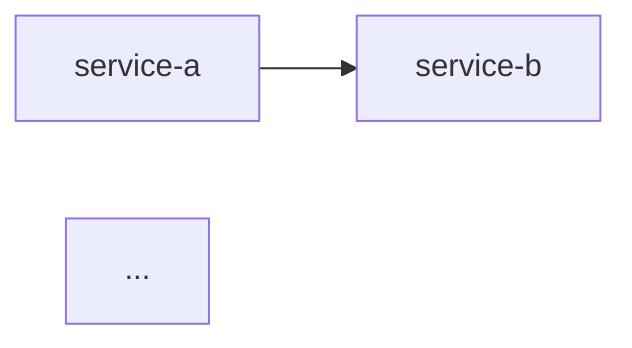

# 종합 개발 계획 수립 가이드

## 목적

설계 산출물을 분석하여 마이크로서비스 목록, 서비스 간 의존관계, 백킹서비스 요구사항, 개발 우선순위를 파악하고 종합 개발 계획서를 생성한다. 3개 에이전트(backend-developer, frontend-developer, ai-engineer)가 담당 영역을 분담 작성하고 architect가 통합 리뷰한다.

## 입력 (이전 단계 산출물)

| 산출물 | 파일 경로 | 활용 방법 |
|--------|----------|----------|
| **선택된 개발 단계** | (Step 0-1에서 사용자 선택) | **개발 범위 결정 — 이 범위 밖의 기능은 계획에서 제외** |
| HighLevel 아키텍처 | `docs/design/high-level-architecture.md` | **14.1 개발 단계** 테이블에서 선택된 Phase의 주요 산출물·마일스톤 확인 |
| 아키텍처 패턴 정의서 | `docs/design/pattern-definition.md` | 기술스택, 아키텍처 패턴 확인 |
| 논리 아키텍처 | `docs/design/logical-architecture.md` | 마이크로서비스 목록 추출 |
| API 설계서 | `docs/design/api/{service-name}-api.yaml` | 엔드포인트 수, API 계약 |
| 내부 시퀀스 설계서 | `docs/design/sequence/inner/{service-name}-*.puml` | 서비스 내부 흐름 |
| 외부 시퀀스 설계서 | `docs/design/sequence/outer/*.puml` | 서비스 간 의존관계, 비동기 통신 |
| 클래스 설계서 | `docs/design/class/{service-name}.puml` | 도메인 모델, 패키지 구조 |
| 패키지 구조 | `docs/design/class/package-structure.md` | 공통 모듈 범위 |
| 데이터 설계서 | `docs/design/database/{service-name}.md` | DB 종류, 테이블 구조 |
| 캐시 설계서 | `docs/design/database/cache-db-design.md` | 캐시 요구사항 |
| 프론트엔드 설계서 | `docs/design/frontend/*.md` | UI/UX, 페이지 목록, API 매핑 |
| AI 서비스 설계서 | `docs/design/ai-service-design.md` | AI 엔드포인트, 프롬프트, 모델 |
| 유저스토리 | `docs/plan/design/userstory.md` | MVP 우선순위 |

## 출력 (이 단계 산출물)

| 산출물 | 파일 경로 |
|--------|----------|
| 종합 개발 계획서 | `docs/develop/dev-plan.md` |

## 방법론

### 작성 원칙
- **선택된 개발 단계(Phase) 범위 내** 기능만 계획에 포함 (범위 외 기능 제외)
- 설계 산출물 기반 사실 확인 (추측 금지)
- MVP Must Have 우선순위
- 3개 에이전트 분담 + architect 통합 리뷰

### 작성 순서

**준비**: 설계 산출물 전체 읽기 및 분석
- `docs/design/high-level-architecture.md`의 **14.1 개발 단계** 테이블에서 선택된 Phase의 주요 산출물·마일스톤을 확인
- 해당 Phase에서 요구하는 기능·서비스·API만 이후 분석 범위로 한정

**실행** (3개 에이전트 병렬):

- **backend-developer 담당**:
  1. 마이크로서비스 목록 추출 (`logical-architecture.md`)
  2. 서비스 간 의존관계 분석 (`sequence/outer/*.puml`)
  3. 백킹서비스 요구사항 정리 (`database/*.md`, `cache-db-design.md`)
  4. 비동기 통신(MQ) 필요 여부 판별 (`sequence/outer/*.puml`)
  5. 백엔드 개발 순서 결정 (의존관계 기반)

- **frontend-developer 담당**:
  6. 프론트엔드 범위 파악 (`frontend/*.md`)
  7. 페이지 목록 추출 (`frontend/uiux-design.md`)
  8. API 매핑 분석 (`frontend/api-mapping.md`)
  9. 프론트엔드 개발 순서 결정 (페이지 우선순위 기반)

- **ai-engineer 담당**:
  10. AI 서비스 존재 여부 판별 (`ai-service-design.md` 존재 + 내용 확인)
  11. AI 엔드포인트 목록 정리 (`api/ai-*-api.yaml`)
  12. AI 개발 순서 결정

**통합**: architect가 3개 영역 결과 통합
  13. Phase별 작업 할당 계획 수립 (의존관계 고려)
  14. 개발 우선순위 결정 (유저스토리 우선순위 기반)
  15. 설계 산출물과의 일관성 검증

**검토**: 설계 산출물과의 일관성 확인

### 검증 방법
- 서비스 목록이 `logical-architecture.md`와 일치하는지
- API 수가 `api/*.yaml`의 엔드포인트 수와 일치하는지
- 3개 영역의 의존관계가 충돌하지 않는지
- AI SKIP 판단이 명확한지

## 출력 형식

```markdown
# 종합 개발 계획서

## 0. 개발 범위

- **선택된 개발 단계**: {Phase N: 주요 산출물 — 마일스톤} (복수 시 나열)
- **범위 요약**: {선택된 Phase에서 구현할 핵심 기능 요약}
- **제외 범위**: {선택하지 않은 Phase의 기능 목록 — 이번 개발에서 제외}

## 1. 마이크로서비스 목록

| 서비스명 | 설명 | 주요 API 수 | 의존 서비스 | 아키텍처 패턴 | 포트 |
|---------|------|------------|-----------|-------------|------|
| {service-name} | {설명} | {N}개 | {의존 목록} | {Layered/Clean/...} | {포트} |

## 2. 서비스 간 의존관계



## 3. 백킹서비스 요구사항

| 백킹서비스 | 종류 | 용도 | 사용 서비스 |
|-----------|------|------|-----------|
| 데이터베이스 | {PostgreSQL/MySQL/...} | {용도} | {서비스 목록} |
| 캐시 | {Redis} | {용도} | {서비스 목록} |
| MQ | {RabbitMQ/Kafka/...} | {용도} | {서비스 목록} |

## 4. AI 서비스 범위

- 포함 여부: {포함/제외}
- 엔드포인트: {목록}
- 사용 모델: {LLM 모델명}

## 5. 프론트엔드 범위

| 페이지 | 주요 기능 | 연동 API | 우선순위 |
|-------|----------|---------|---------|

- **프로토타입 경로**: `docs/plan/design/uiux/prototype/` (HTML, CSS, JS)

## 6. 개발 순서 (Phase별)

### Phase 1: 환경 구성
- 백엔드: {항목}
- 프론트엔드: {항목}
- AI: {항목 또는 SKIP}
- 백킹서비스: {항목}

### Phase 2: API 계약 기반 병렬 개발
- 백엔드 서비스 개발 순서: {service-1} → {service-2} (병렬 가능 표시)
- 프론트엔드 페이지 개발 순서: {page-1} → {page-2}
- AI 서비스 개발 순서: {항목 또는 SKIP}

### Phase 3: 통합 연동
- 프론트엔드 실제 API 연동
- 백엔드-AI 연동 (해당 시)

### Phase 4: 테스트 및 QA
- 테스트 시나리오 (유저스토리 기반)

## 7. 아키텍처 결정사항 (ADR 요약)

| 결정 | 선택지 | 결정 사유 | 영향 범위 |
|------|--------|----------|----------|
| {결정 제목} | {A안/B안} | {근거} | {영향받는 서비스} |

## 8. 서비스별 입력 파일 매핑

| 서비스 | API 명세 | DB 설계 | 패키지 구조 | 행위 계약 테스트 |
|--------|---------|---------|-----------|----------------|
| {service-name} | `api/{service-name}-api.yaml` | `database/{service-name}.md` | `class/package-structure.md` #{section} | `test/design-contract/{service-name}/` |

## 9. 테스트 시나리오 (유저스토리 기반)

| TC-ID | 유저스토리 | 시나리오 | 검증 포인트 | 관련 시퀀스 |
|-------|-----------|---------|-----------|-----------|
| TC-01 | {US-ID} | {시나리오 설명} | {기대 결과} | {sequence 파일명} |

## 10. 환경 구성 정보 (Step 2 가이드용)

### 10-1. 공통 모듈 구성
| 컴포넌트 | 클래스명 | 설명 |
|----------|---------|------|
| {Base Entity} | {BaseEntity.java} | {JPA 공통 필드 (id, createdAt, updatedAt)} |
| {Global Exception Handler} | {GlobalExceptionHandler.java} | {공통 예외 처리} |
| {공통 DTO} | {ApiResponse.java} | {공통 응답 래퍼} |

> common-base.puml의 공통 컴포넌트를 여기에 추출하여 기록한다.

### 10-2. 백킹서비스 요구사항
| 백킹서비스 | 필요 여부 | 판단 근거 | 설정 정보 |
|-----------|----------|----------|----------|
| PostgreSQL | O/X | {서비스별 DB 사용 여부} | {스키마명, 포트} |
| Redis | O/X | {캐시 설계서 기반} | {포트, DB번호} |
| MQ (RabbitMQ/Kafka) | O/X | {서비스 간 비동기 통신 존재 여부} | {큐명, exchange} |
| Prism Mock | O/X | {API Mock 필요 여부} | {마운트 대상 yaml} |

> 외부 시퀀스 설계서의 비동기 통신 흐름을 분석하여 MQ 필요 여부를 미리 결정한다.

### 10-3. 보안 구성
| 항목 | 설정 | 근거 |
|------|------|------|
| 인증 방식 | {JWT / OAuth2 / Session} | {아키텍처 설계 기반} |
| Security 클래스 | {SecurityConfig, JwtTokenProvider, ...} | {클래스 설계서 기반} |
| 보호 대상 API | {/api/v1/** 중 인증 필요 경로} | {API 명세 securitySchemes} |

### 10-4. AI 서비스 구조 (해당 시)
| 항목 | 값 | 근거 |
|------|------|------|
| 주요 클래스 | {클래스명 목록} | {AI 클래스 설계서 기반} |
| 의존성 방향 | {Router → Service → Client → LLM} | {클래스 설계서 기반} |
| LLM 제공자 | {OpenAI / Anthropic / ...} | {AI 서비스 설계서} |
| 포트 | {8000} | {HighLevel 아키텍처} |

### 10-5. 기술스택 정보
| 영역 | 항목 | 값 | 근거 |
|------|------|------|------|
| 백엔드 | Java 버전 | {17/21} | {HighLevel 아키텍처} |
| 백엔드 | Spring Boot | {3.x} | {HighLevel 아키텍처} |
| 백엔드 | 빌드 도구 | {Gradle} | {HighLevel 아키텍처} |
| 프론트엔드 | Node.js | {20.x} | {HighLevel 아키텍처} |
| 프론트엔드 | 프레임워크 | {React/Vue/Flutter} | {HighLevel 아키텍처} |
| AI | Python | {3.11+} | {HighLevel 아키텍처} |
| AI | 프레임워크 | {FastAPI} | {HighLevel 아키텍처} |

> HighLevel 아키텍처 문서의 기술스택 정보를 여기에 추출하여 기록한다.
```

## 품질 기준

- [ ] **개발 범위(섹션 0)에 선택된 Phase와 제외 범위가 명시**
- [ ] 선택 범위 내 마이크로서비스가 목록에 포함 (범위 외 서비스는 제외)
- [ ] 서비스 간 의존관계가 시퀀스 설계서와 일치
- [ ] MVP 우선순위가 유저스토리와 일치
- [ ] AI 서비스 포함/제외 여부가 명시
- [ ] 백킹서비스 요구사항이 데이터 설계서와 일치
- [ ] Phase별 작업 할당이 의존관계를 위반하지 않음
- [ ] 선택 범위 외 기능이 계획에 혼입되지 않음
- [ ] **서비스별 입력 파일 매핑(섹션 8)이 모든 서비스에 대해 완성**
- [ ] **테스트 시나리오(섹션 9)가 유저스토리 Must Have 전체를 커버**
- [ ] **환경 구성 정보(섹션 10)가 공통 모듈, 백킹서비스, 보안, AI 서비스 항목을 포함**

## 주의사항

- 설계서에 없는 서비스를 임의 추가하지 않음
- 물리 아키텍처의 인프라 내용은 deploy 단계 범위이므로 포함하지 않음
- AI SKIP 판단 시 파일 존재 여부뿐 아니라 내용까지 확인 (2단계 검증)
- 개발 순서는 서비스 간 의존관계를 고려하여 선행 서비스를 먼저 배치
