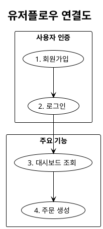

# 이벤트 스토밍 가이드

## 목적

DDD(Domain-Driven Design)의 Event Storming 기법을 활용하여
선택된 솔루션의 시스템 이벤트 흐름을 분석하고,
PlantUML 시퀀스 다이어그램으로 표현하여 유저스토리 작성을 준비함.

## 입력 (이전 단계 산출물)

| 산출물 | 파일 경로 | 활용 방법 |
|--------|----------|----------|
| 핵심 솔루션 | `docs/plan/think/핵심솔루션.md` | 이벤트 스토밍 대상 솔루션의 범위 설정 |
| 고객 분석 | `docs/plan/define/고객분석.md` | Actor(사용자 역할) 정의에 활용 |
| 시장 조사 | `docs/plan/define/시장조사.md` | 규제/법적 환경 → 정책/규칙 반영, 경쟁사 기능 참조 |
| 유저 저니 맵 | `docs/plan/define/유저저니맵.md` | 유저플로우와 고객 여정 단계 매핑, 감정 저점 대응 설계 |

## 출력 (이 단계 산출물)

| 산출물 | 파일 경로 |
|--------|----------|
| 유저플로우 연결도 | `docs/plan/think/es/userflow.puml` |
| 유저플로우별 시퀀스 다이어그램 | `docs/plan/think/es/{순번}-{유저플로우명}.puml` |

## 방법론

### Event Storming 핵심 요소

#### 이벤트 (Events)
시스템에서 발생하는 중요한 사건 (과거형)
- 표기: `[이벤트] {이벤트명} 발생됨`
- 예: 회원가입 완료됨, 주문 생성됨, 결제 완료됨

#### 커맨드 (Commands)
사용자나 시스템이 수행하는 행위 (명령형)
- 표기: `[커맨드] {커맨드명}`
- 예: 회원가입 요청, 주문 생성, 결제 진행

#### 액터 (Actors)
시스템과 상호작용하는 주체
- 예: 사용자, 관리자, 배송 기사, 시스템 스케줄러

#### 정책/규칙 (Policies/Rules)
이벤트 발생 시 자동으로 실행되는 규칙
- 표기: `[정책/규칙] {규칙 내용}`
- 예: 이메일 중복 확인, 재고 확인 필수, 결제 금액 검증

#### 외부 시스템 (External Systems)
시스템이 연동하는 외부 서비스
- 표기: `(E){외부시스템명}`
- 예: (E)결제 게이트웨이, (E)이메일 발송 서비스

#### 필요 데이터 (Data)
각 단계에서 필요한 데이터
- 표기: 화살표 라벨에 `[데이터] {데이터명}`
- 예: (이메일, 비밀번호), (주문 ID, 상품 목록)

### PlantUML 시퀀스 다이어그램 작성

#### 1. 유저플로우 식별 (5-10개)
핵심 솔루션의 주요 사용자 플로우를 식별함.

#### 2. 유저플로우 간 연결도

파일명: `think/es/userflow.puml`



#### 3. 각 유저플로우별 시퀀스 다이어그램

파일명: `think/es/{순번}-{유저플로우명}.puml`

**작성 규칙:**
- `!theme mono` 사용
- 한국어로 작성
- **참여자**: Actor, 내부서비스, 외부시스템으로만 구성
- **내부서비스**: 내부의 업무 그룹을 명시 (예: 회원업무, 결제업무)
- **외부시스템**: `(E){외부시스템명}`으로 표시
- 내부서비스 내부와 외부시스템 내부에서 이루어지는 플로우는 표시하지 않음
- 이벤트 스토밍 요소를 명확히 표시: `[{요소}] {내용}`

### 고객 경험 연결

#### 유저플로우-여정 단계 매핑
유저플로우 식별 시 고객 여정 맵을 참조하여, 각 유저플로우가 고객 여정의 어느 단계를 지원하는지 매핑 테이블을 작성할 것.

```markdown
| 유저플로우 | 고객 여정 단계 | 감정 레벨 | 비고 |
|-----------|-------------|----------|------|
| {유저플로우명} | {여정 단계} | {1-5} | {특이사항} |
```

#### 감정 저점 대응 지침
여정 맵에서 **감정 레벨 2 이하**인 단계의 유저플로우는 다음 UX 보완 이벤트를 추가할 것:
- **에러 처리 강화**: 사용자 실수에 대한 친절한 안내 메시지
- **피드백 이벤트**: 진행 상태를 사용자에게 명확히 전달
- **안내 메시지**: 복잡한 단계에서 도움말/가이드 제공
- **복구 경로**: 실패 시 이전 단계로 쉽게 돌아갈 수 있는 경로

### 마이크로서비스 정의

#### 5단계 프로세스

1. **이벤트 클러스터링**: 비즈니스 개념 기준으로 이벤트 그룹화
2. **Aggregate 식별**: 이벤트가 변경하는 엔티티와 생명주기 파악
3. **바운디드 컨텍스트 정의**: Aggregate와 정책/규칙을 묶어 경계 설정
4. **컨텍스트 맵핑**: 컨텍스트 간 관계와 통신 패턴 정의
5. **분할/병합 결정**: 최종 마이크로서비스 도출

#### 분할 기준 (하나 이상 해당 시 분리)
| 기준 | 설명 |
|-----|------|
| 차별화 핵심 | 비즈니스 경쟁력 원천 기능 |
| 부하 변동 | 스케일링 패턴이 다름 |
| 변경 빈도 | 배포 주기가 다름 |
| 데이터 소유 | 별도 Aggregate Root 소유 |

#### 병합 기준 (해당 시 통합 고려)
| 기준 | 지표 |
|-----|------|
| 트랜잭션 경계 | 한 트랜잭션 완료를 위해 복수의 Bounded Context의 데이터를 Write해야 한다면 통합 |
| 서비스 크기 | 코드 5,000줄 미만 |
| 호출 빈도 | 동기 호출 90% 이상 |
| 운영 복잡도 | 팀당 3-5개 서비스 적정 |

#### MVP 단계 병합 전략
초기에는 운영 복잡도를 낮추기 위해 관련 컨텍스트를 병합하고,
트래픽/복잡도 증가 시 분리함.

### PlantUML 문법 검사

각 `.puml` 파일 생성 즉시 `check-plantuml` 도구로 문법 검증을 수행합니다.
상세 사용법은 `resources/tools/check-plantuml.md`를 참조하세요.

```bash
# 개별 파일 검증
bash tools/diagram/check-plantuml.sh docs/plan/think/es/userflow.puml

# 전체 이벤트 스토밍 파일 일괄 검증
for f in docs/plan/think/es/*.puml; do
  bash tools/diagram/check-plantuml.sh "$f"
done
```

**검증 기준:**
- 종료 코드 `0`: 문법 검증 통과
- 종료 코드 `1`: 문법 오류 → 오류 내용 확인 후 수정

**필수**: 모든 `.puml` 파일이 문법 검증을 통과해야 다음 단계로 진행합니다.

## 출력 형식

```markdown
### 유저플로우 연결도
파일: `docs/plan/think/es/userflow.puml`

### 유저플로우별 시퀀스 다이어그램
파일: `docs/plan/think/es/{순번}-{유저플로우명}.puml`

### 유저플로우-여정 단계 매핑
| 유저플로우 | 고객 여정 단계 | 감정 레벨 | 비고 |
|-----------|-------------|----------|------|

### 마이크로서비스 정의
| 서비스명 | 바운디드 컨텍스트 | 관련 유저플로우 | 주요 이벤트 |
|---------|----------------|-------------|-----------|
```

## 품질 기준

### 완료 체크리스트
- [ ] 유저플로우 5-10개 식별
- [ ] PlantUML 문법 검사 전체 통과
- [ ] 이벤트/커맨드/정책 표기 규칙 준수 ([이벤트], [커맨드], [정책/규칙])
- [ ] 마이크로서비스 정의 포함 (이벤트 클러스터링 → Aggregate → 바운디드 컨텍스트)
- [ ] 유저플로우-여정 단계 매핑 테이블 작성
- [ ] 감정 레벨 2 이하 단계에 UX 보완 이벤트 추가
- [ ] 시장조사.md의 규제/법적 환경이 정책/규칙에 반영됨
- [ ] 핵심솔루션.md, 고객분석.md와 일관성 확인

### 정량 기준
- 유저플로우: 5-10개
- PlantUML 문법 검사: 전체 통과
- 마이크로서비스: 2개 이상

## 주의사항

- `!theme mono` 사용
- 한국어로 작성
- 외부시스템의 내부 플로우는 표시하지 않음
- 이벤트는 과거형, 커맨드는 명령형
- 이벤트 스토밍 요소 태그 반드시 표시
- 파일명: `{2자리순번}-{유저플로우명}.puml`
- **각 `.puml` 파일 생성 즉시 PlantUML 문법 검사 수행**
