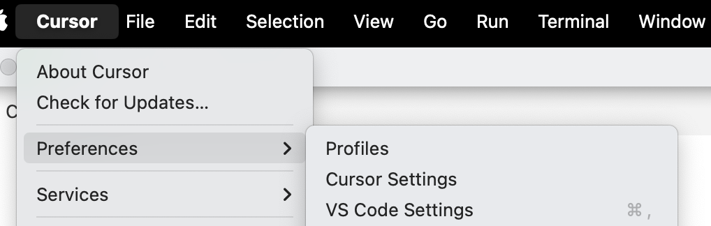
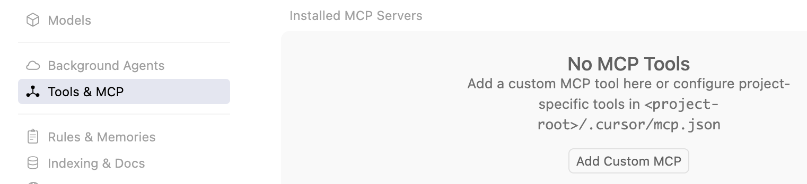
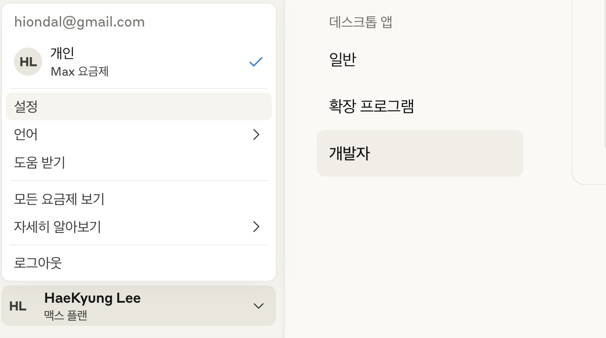
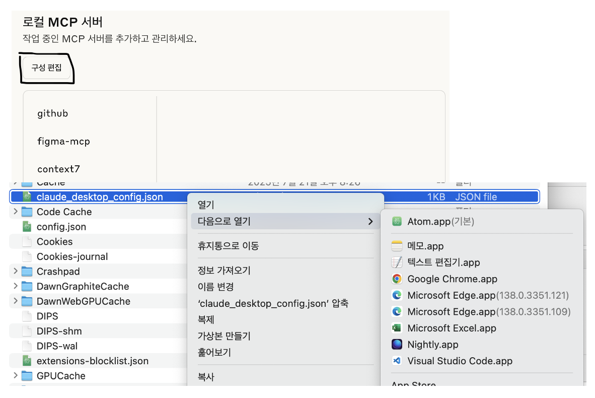
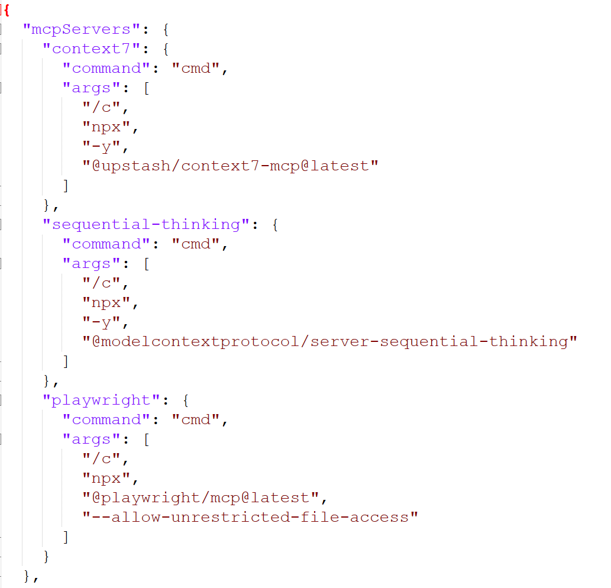
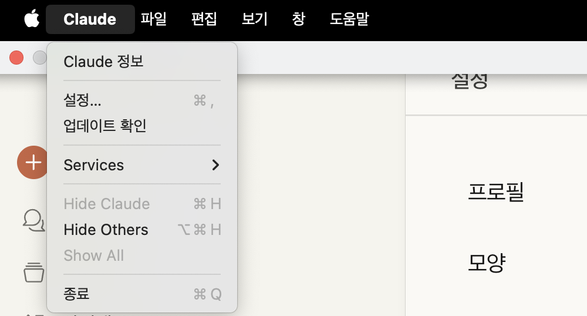
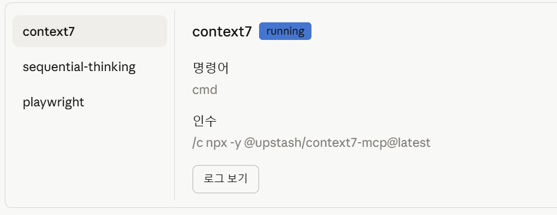
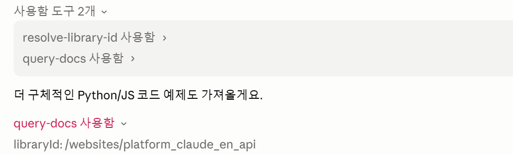
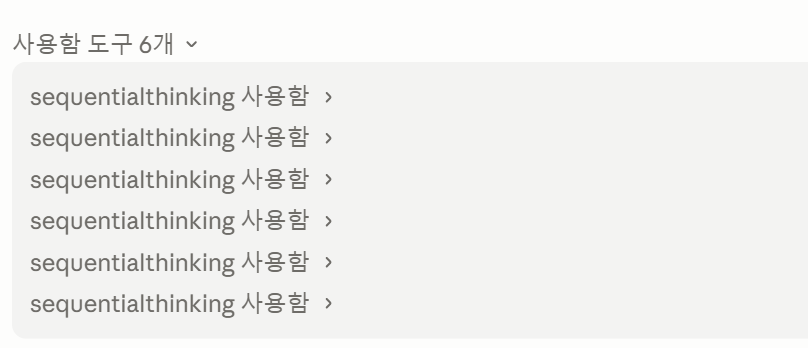

# MCP 설치 및 구성 방법 

- [MCP 설치 및 구성 방법](#mcp-설치-및-구성-방법)
  - [Overview](#overview)
  - [주요 MCP 이해 및 준비 작업](#주요-mcp-이해-및-준비-작업)
  - [Claude Code에 주요 MCP서버 연결](#claude-code에-주요-mcp서버-연결)
  - [Cursor에 주요 MCP서버 연결](#cursor에-주요-mcp서버-연결)
  - [Claude CoWork에 주요 MCP서버 연결](#claude-cowork에-주요-mcp서버-연결)
  - [MCP 서버 설치 확인](#mcp-서버-설치-확인)
    - [Context7](#context7)
    - [Sequential Thinking](#sequential-thinking)
    - [Playwright](#playwright)
  - [MCP 서버 삭제](#mcp-서버-삭제)

---

## Overview
MCP(Model Context Protocol)는 AI와 외부 서비스(예: Goole Drive, Kakao Map 등)가 통신하기 위한 표준입니다.  
Claude의 개발사인 Anthropic에서 제안하여 업계 표준이 되었습니다.   
Claude Code와 같은 AI툴들이 외부서비스와 연동하려면 외부서비스가 가이드하는 방법대로 MCP 서버 연결 설정을 해야 합니다.  
MCP서버는 'http'를 통해 연결할 수도 있고 PC에 설치하여 연결할 수도 있습니다.   
이 가이드에서는 아래와 같은 내용을 가이드 합니다. 
- Claude Code에 주요 MCP서버 연결  
- Claude CoWork에 주요 MCP서버 연결 
- MCP포탈 이용 방법 

---

## 주요 MCP 이해 및 준비 작업  
아래 MCP는 모두 필요하므로 추가해야 합니다.  
실제 추가 작업은 이후 수행하므로 각 MCP의 역할만 이해하십시오.   
  
- Context7 MCP: 최신 개발 방식 제공하여 코드의 최신성 향상   
https://github.com/upstash/context7

- Sequential Thinking MCP: AI가 논리적 작업 순서를 설계하도록 지원    
https://mcp.so/server/sequentialthinking/modelcontextprotocol

- Playwright MCP: UI테스트를 지원. 웹브라우저를 실행하여 스스로 테스트나 분석을 수행할 수 있음.   
https://github.com/microsoft/playwright-mcp

 
---

## Claude Code에 주요 MCP서버 연결 
   
Claude Code의 MCP설정은 '{사용자홈}/.claude.json'파일에 설정합니다.  

아래 명령으로 이 파일에 추가합니다.    

Windows:   
```
claude mcp add-json context7 '{"command":"cmd","args":["/c","npx","-y","@upstash/context7-mcp@latest"]}' --scope user
claude mcp add-json sequential-thinking '{"command":"cmd","args":["/c","npx","-y","@modelcontextprotocol/server-sequential-thinking"]}' --scope user
claude mcp add-json pw '{"command":"cmd","args":["/c","npx","@playwright/mcp@latest","--allow-unrestricted-file-access"]}' --scope user
```

Mac/Linux:   
```
claude mcp add-json context7 '{"command":"npx","args":["-y","@upstash/context7-mcp@latest"]}' --scope user
claude mcp add-json sequential-thinking '{"command":"npx","args":["-y","@modelcontextprotocol/server-sequential-thinking"]}' --scope user
claude mcp add-json pw '{"command":"npx","args":["-y","@playwright/mcp@latest","--allow-unrestricted-file-access"]}' --scope user
```
      
아래 명령으로 설치 및 연결 확인을 합니다.   
```
claude mcp list 
```

---

## Cursor에 주요 MCP서버 연결 

1)환경설정 클릭: Cursor > Preferences > Cursor Settings 클릭     
  

2)Tools & MCP 선택 후 [Add Custom MCP]클릭   


3)OS에 맞게 MCP설정값 붙여넣은 후 저장 후 닫기       
Linux/Mac:
https://github.com/unicorn-plugins/npd/blob/main/resources/references/MCP-linuxmac.json

Windows:
https://github.com/unicorn-plugins/npd/blob/main/resources/references/MCP-window.json

  
---

## Claude CoWork에 주요 MCP서버 연결
Claude CoWork의 MCP서버 설정은 OS별로 아래 파일에 설정 합니다.  
Claude Pro 이상 구독 시에만 설정합니다.    
  
MCP 설정 파일:  
- **Linux**: "~/.config/Claude/claude_desktop_config.json"
- **Mac**: "$HOME/Library/Application Support/Claude/claude_desktop_config.json"
- **Windows**: "$HOME/AppData/Roaming/Claude/claude_desktop_config.json"

**1.설정파일 열기**    
Claude CoWork을 열고 설정 페이지를 엽니다.  
설정 페이지는 좌측 하단에서 로그인 사용자명을 선택하고 '설정'을 클릭합니다.  
 

그리고 설정 메뉴 중 가장 하단에 있는 '개발자'를 선택합니다.   
'[구성편집]'버튼을 누르고 파일을 편집기에서 엽니다.  


**2.설정 추가**  
OS별로 설정값을 복사합니다.  
Linux/Mac:
https://github.com/unicorn-plugins/npd/blob/main/resources/references/MCP-linuxmac.json
  
Windows:
https://github.com/unicorn-plugins/npd/blob/main/resources/references/MCP-window.json

아래 그림과 같이 mcpServers 항목 밑에 잘 붙여 넣습니다.  


**3.확인**    
Claude CoWork이 실행 중이면 종료 합니다.   
단순히 창의 'X'버튼으로 닫지 말고 메인 메뉴에서 '종료'해야 합니다.   
예를 들어 Mac은 아래와 같이 종료합니다.  
   

Claude CoWork을 다시 시작하여 "설정"페이지의 "개발자"메뉴를 확인합니다.   
추가한 MCP서버 목록이 보이고 각 MCP서버를 선택하였을 때 'running'이라고 나와야 합니다.   
  
  
---

## MCP 서버 설치 확인
### Context7
```
context7 mcp로 'Claude API 프롬프트 캐싱 설정' 안내
```
아래와 같이 나오면 정상 동작하는 것임.   
  

### Sequential Thinking 
```
sequential thinking으로 프롬프팅 비용 최적화 방안 수립
```
정상동작 화면 예시:  
     

### Playwright
```
playwright mcp로 https://daum.net 오픈하여 아무 페이지나 클릭    
```

브라우저 창이 열리고 제대로 수행되면 정상 설치된 것임

## MCP 서버 삭제  
추가된 MCP를 삭제하는 방법입니다.  
```
claude mcp remove {MCP이름} [-s {scope}]
```

예시)
```
claude mcp remove smithery-ai-github -s user
```
