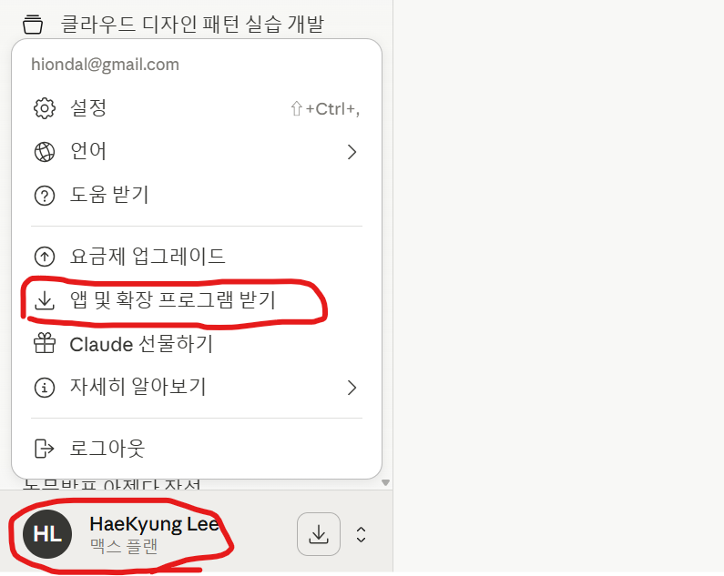
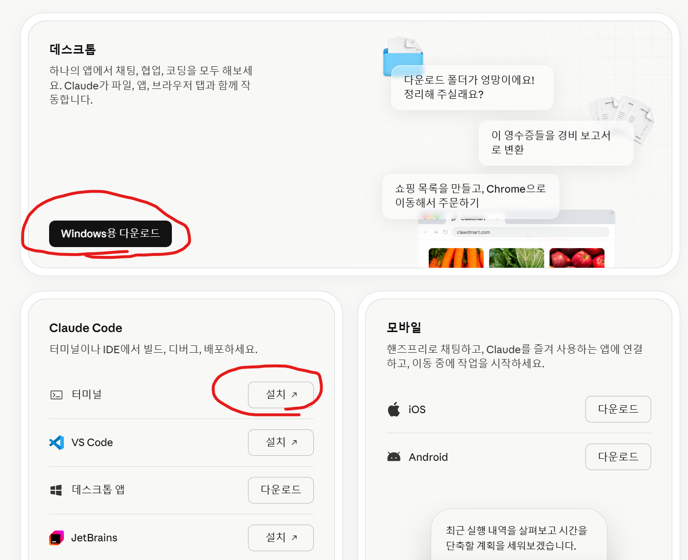

# MCP 설치 및 구성 방법 

- [MCP 설치 및 구성 방법](#mcp-설치-및-구성-방법)
  - [Overview](#overview)
  - [사전작업](#사전작업)
  - [주요 MCP 이해 및 준비 작업](#주요-mcp-이해-및-준비-작업)
  - [Claude CoWork에 주요 MCP서버 연결](#claude-cowork에-주요-mcp서버-연결)
  - [Claude Code에 주요 MCP서버 연결](#claude-code에-주요-mcp서버-연결)
  - [Cursor에 주요 MCP서버 연결](#cursor에-주요-mcp서버-연결)
  - [Figma MCP Socket 설치](#figma-mcp-socket-설치)
  - [Magic MCP 설치(옵션)](#magic-mcp-설치옵션)
  - [MCP포탈 이용 방법](#mcp포탈-이용-방법)
    - [GitHub MCP 설치](#github-mcp-설치)
    - [Google Map (옵션)](#google-map-옵션)
    - [온라인 Claude에 추가 (옵션)](#온라인-claude에-추가-옵션)
    - [주의사항](#주의사항)
  - [MCP서버 삭제](#mcp서버-삭제)

---

## Overview
MCP(Model Context Protocol)는 AI와 외부 서비스(예: Goole Drive, Kakao Map 등)가 통신하기 위한 표준입니다.  
Claude의 개발사인 Anthropic에서 제안하여 업계 표준이 되었습니다.   
Claude Code와 같은 AI툴들이 외부서비스와 연동하려면 외부서비스가 가이드하는 방법대로 MCP 서버 연결 설정을 해야 합니다.  
MCP서버는 'http'를 통해 연결할 수도 있고 PC에 설치하여 연결할 수도 있습니다.   
이 가이드에서는 아래와 같은 내용을 가이드 합니다. 
- Claude Code에 주요 MCP서버 연결  
- Claude CoWork에 주요 MCP서버 연결 
- MCP포탈 이용 방법 

---

## 사전작업

**1.Node설치**         
아래 명령으로 node 설치 확인 후 미설치 시 설치   
Window 사용자는 하단 작업줄의 돋보기 아이콘 클릭 > 'cmd'입력하여 '명령 프롬프트' 실행       
```
node -v
```

https://github.com/cna-bootcamp/clauding-guide/blob/main/guides/setup/00.prepare1.md#nodejs-%EC%84%A4%EC%B9%98

**2.Git Client 설치**     
아래 명령으로 git 설치 확인 후 미설치 시 설치   
```
git -v
```   
https://github.com/cna-bootcamp/clauding-guide/blob/main/guides/setup/00.prepare1.md#git-client-%EC%84%A4%EC%B9%98
  
**3.bun 설치:**   
Linux/Mac사용자는 기본 터미널에서 수행하고, Window사용자는 Window Terminal의 Git Bash에서 수행합니다.   
Window Terminal 미설치시에는 하단 작업줄의 돋보기 아이콘 클릭 > 'git'입력하여 'Git Bash' 실행    

1)설치    
```bash
curl -fsSL https://bun.sh/install | bash
```

2)OS별 PATH 설정      
macOS  
```bash
echo 'export PATH="$HOME/.bun/bin:$PATH"' >> ~/.zshrc
source ~/.zshrc
```

Window GitBash    
```
echo 'export PATH="$HOME/.bun/bin:$PATH"' >> ~/.bashrc
source ~/.bashrc
```

**4.AI툴 설치**    
중요) 아래 AI툴 중 **사용할 툴을 모두 설치**합니다.      
강사의 특별한 언급이 없으면 모두 설치 해 주십시오.   

**1)Claude CoWork와 Claude Code 설치**    
Claude CoWork는 Claude Web과 유사한 기능을 로컬에서 사용하기 위한 로컬 Claude툴입니다.  
Claude Code도 CoWork과 동일하게 로컬에 설치하는 Claude 툴입니다.   
차이는 CoWork는 로컬의 가상환경 내에서 수행되고 Code는 로컬에서 직접 수행된다는 것입니다.   
CoWork는 가상환경 내에서 수행되기 때문에 외부 API과 같은 일부 기능이 제약됩니다.   

   
   

  
**3)Cursor 설치**        
아래 사이트에서 설치 프로그램 다운로드해서 설치하세요.   
https://cursor.com/

---

## 주요 MCP 이해 및 준비 작업  
아래 MCP는 모두 필요하므로 추가해야 합니다.  
실제 추가 작업은 이후 수행하므로 각 MCP의 역할만 이해하십시오.   
  
- Context7 MCP: 최신 개발 방식 제공하여 코드의 최신성 향상   
https://github.com/upstash/context7

- Sequential Thinking MCP: AI가 논리적 작업 순서를 설계하도록 지원    
https://mcp.so/server/sequentialthinking/modelcontextprotocol

- Playwright MCP: UI테스트를 지원. 웹브라우저를 실행하여 스스로 테스트나 분석을 수행할 수 있음.   
https://github.com/microsoft/playwright-mcp

 
---

## Claude CoWork에 주요 MCP서버 연결
Claude CoWork의 MCP서버 설정은 OS별로 아래 파일에 설정 합니다.  
MCP 설정 파일:  
- **Linux**: "~/.config/Claude/claude_desktop_config.json"
- **Mac**: "$HOME/Library/Application Support/Claude/claude_desktop_config.json"
- **Windows**: "$HOME/AppData/Roaming/Claude/claude_desktop_config.json"

**1.설정파일 열기**    
Claude CoWork을 열고 설정 페이지를 엽니다.  
설정 페이지는 좌측 하단에서 로그인 사용자명을 선택하고 '설정'을 클릭합니다.  
 

그리고 설정 메뉴 중 가장 하단에 있는 '개발자'를 선택합니다.   
'[구성편집]'버튼을 누르고 파일을 편집기에서 엽니다.  


**2.설정 추가**  
OS별로 설정값을 복사합니다.  
Linux/Mac:


Windows:
https://github.com/cna-bootcamp/clauding-guide/blob/main/references/MCP-window.json

기존 설정 파일 내용을 위 내용으로 덮어쓰고 저장합니다.  

**3.확인**    
Claude CoWork이 실행 중이면 종료 합니다.   
단순히 창의 'X'버튼으로 닫지 말고 메인 메뉴에서 '종료'해야 합니다.   
예를 들어 Mac은 아래와 같이 종료합니다.  
  

Claude CoWork을 다시 시작하여 "설정"페이지의 "개발자"메뉴를 확인합니다.   
추가한 MCP서버 목록이 보이고 각 MCP서버를 선택하였을 때 'running'이라고 나와야 합니다.   

  
---

## Claude Code에 주요 MCP서버 연결 
   
Claude Code의 MCP설정은 '{사용자홈}/.claude.json'파일에 설정합니다.  

**1.MCP 설정값 복사**   
아래 링크를 열어 MCP설정값을 복사합니다. 
주의할 것은 **첫라인의 '{'와 마지막 라인의 '}'은 제외**하고 복사합니다.  

Linux/Mac:
https://github.com/cna-bootcamp/clauding-guide/blob/main/references/MCP-linuxmac.json

Windows:
https://github.com/cna-bootcamp/clauding-guide/blob/main/references/MCP-window.json

**2.MCP 설정값 추가**      
터미널을 열고 이 파일을 열어 MCP설정을 추가합니다.  
```
cd ~
code .claude.json
```

'mcpServers' 항목이 이미 있는지 찾습니다.   
1)'mcpServers'항목이 없는 경우  
맨 아래줄 "}" 전 라인 끝에 콤마 추가   


위에서 복사한 설정값 붙여넣기   
 

파일을 저장합니다.  
2)'mcpServers'항목이 있는 경우 
'mcpServers' 안의 기존 MCP설정 끝에 추가합니다.  

**3.설치확인**        
아래 명령으로 설치 및 연결 확인을 합니다.   
```
claude mcp list 
```

---

## Cursor에 주요 MCP서버 연결 

1)환경설정 클릭: Cursor > Preferences > Cursor Settings 클릭     


2)Tools & MCP 선택 후 [Add Custom MCP]클릭   


3)OS에 맞게 MCP설정값 붙여넣은 후 저장 후 닫기       
- Linux/Mac: https://github.com/cna-bootcamp/clauding-guide/blob/main/references/MCP-linuxmac.json
- Windows: https://github.com/cna-bootcamp/clauding-guide/blob/main/references/MCP-window.json

4)불필요한 Figma MCP 기능 비활성화     
아래 그림과 같이 Read하는 기능만 남기고 Disable합니다.   
 

---

## Figma MCP Socket 설치
Figma MCP는 Figma의 브레인스토밍 결과나 디자인 요소를 AI가 읽을 수 있도록 하는 강력한 기능을 제공합니다.   
참고로 유투브나 블로그에 여러 방법이 있는데 지금은 동작 안하는 방법이 많습니다.   
그래서 로컬에 Figma MCP Socket 서버를 설치해서 연동하는 방법으로 설명합니다.   
정확히 말하면 Figma MCP는 이미 설치된것이고 이 작업은 Figma에 접근하는 proxy서버를 설치하는 것입니다.  
  
**1)Figma MCP 서버 설치**    
아무곳에나 설치해도 되지만 홈디렉토리 밑에 설치하는게 제일 낫습니다.  
```
cd ~
```
  
소스를 다운로드 하고 설치합니다.   
```
git clone https://github.com/arinspunk/claude-talk-to-figma-mcp.git
cd claude-talk-to-figma-mcp
bun install
```

빌드합니다.       
macOS/Linux:     
```
bun run build   
```
Windows:      
```
bun run build:win   
```

Figma MCP의 소켓서버를 실행합니다.   
이 서버를 통해 AI와 Figma가 통신합니다.    
```
bun socket
```

**2)Figma 플러그인 설치**    
두가지 방법이 있습니다.  
온라인 Figma에 설치하는 방법과 데스크탑에 설치하는 방법입니다.   
사용하는 Figma에 따라 플러그인을 설치하세요.    

2-1)옵션1: 온라인 Figma에 플러그인 설치    
  

  


2-2)옵션2: Figma Desktop에 플러그인 설치     
-Figma Client설치    
  


-Figma Desktop앱에 플로그인 설치      
Figma Desktop을 실행합니다.    
연동할 파일을 오픈합니다.   
아래 그림과 같이 'Import from manifest '을 실행합니다.   
'~/claude-talk-to-figma-mcp/src/claude_mcp_plugin/manifest.json'을 선택합니다.   


설치된 플러그인을 찾아서 실행해 봅니다.    
잘 연결이 되는지 확인합니다.   
 

  

**3)Figma MCP 사용법**     
3-1)온라인 Figma 사용 시    
연동할 객체를 선택합니다.    
그리고 'Cursor Talk to Figma MCP Plugin'을 실행합니다.
  

3-2)Figma Desktop 사용 시    
연동할 객체를 선택합니다.    
그리고 'Claude MCP Plugin'을 실행합니다.   
  

**4)클로드에서 사용하기**    
창 가운데에 있는 채널ID를 복사합니다.    
예시)
```
Connected to server on port 3055 in channel: l966iq7b
```

Claude Code 프롬프트에서 이 채널ID를 제공하여 작업합니다.   
예시)
```
피그마채널 'l966iq7b'에 접근하여 이벤트스토밍결과를 마크다운파일로 정리하세요.   
```

---

## Magic MCP 설치(옵션)
'.claude.json' 파일의 'mcpServers' 안에 아래 Magic MCP 설정을 추가합니다.  
API Key는 아래 주소에서 생성하여 지정합니다.   
- https://github.com/21st-dev/magic-mcp
- API Key 생성 필요: https://21st.dev/magic/console 에서 'Setup Magic MCP' 버튼 클릭

Window:
```
"magic": {
  "command": "cmd",
  "args": [
    "/c",
    "npx",
    "-y",
    "@21st-dev/magic@latest"
  ],
  "env": {
    "API_KEY": "{API Key}"
  }
}
```

Linux/Mac:
```
"magic": {
  "command": "npx",
  "args": [
    "-y",
    "@21st-dev/magic@latest"
  ],
  "env": {
    "API_KEY": "{API Key}"
  }
}
```

파일 저장 후 아래 명령으로 설치를 확인합니다.   
```
claude mcp list 
```

---


## MCP포탈 이용 방법 
여러 사이트가 있는데 그 중에 가장 많이 사용하는 곳은 Smithery(스미써리: 대장간)입니다.  
https://smithery.ai/
주의할 점은 개인이 올릴 수 있고 Smithery서버를 통해 사용하기 때문에 동작하다가 안될 수 있다는 것입니다.   

GitHub와 Figma MCP 추가를 이 사이트를 이용해서 추가해 보겠습니다.   

### GitHub MCP 설치
**1.GitHub MCP 설치**       
https://smithery.ai/ 에서 'GitHub'를 검색합니다.  


추가할 바이브 코딩툴을 선택합니다. Claude Code를 선택합니다.    
. 

본인의 GitHub Access Token을 입력하고 'Connect'를 클릭합니다.   
GitHub Access Token 만드는 방법은 [여기](https://github.com/cna-bootcamp/handson-azure/blob/main/prepare/setup-local.md#github-%ED%9A%8C%EC%9B%90%EA%B0%80%EC%9E%85-%EB%B0%8F-%ED%86%A0%ED%81%B0-%EC%83%9D%EC%84%B1)를 참고하세요.  


터미널을 열고 MCP 추가 명령을 수행합니다.  
  
중요) 마지막에 **Scope 옵션 '-s user'를 반드시 추가**   
MCP서버를 어느 범위까지 사용할지 지정하는 옵션입니다.   
- local: 특정 디렉토리에서만 특화된 MCP 추가 
- project: 특정 프로젝트 디렉토리에서만 특화된 MCP 추가
- user: 현재 OS 사용자 전체가 사용하는 MCP 추가  

Tip) MCP 이름 변경   
MCP 주소 앞에 있는 이름을 변경하면 됩니다.  
아래 예에서는 'smithery-ai-github'입니다. 

예시)
```
claude mcp add --transport http smithery-ai-github "https://server.smithery.ai/@smithery-ai/github/mcp?api_key=6bf03d02-65a9-4a0d-ac05-6d4a5b0d4343&profile=motionless-flamingo-aj9dsM" -s user
```

아래 명령으로 추가 되었는지 확인합니다.  
```
claude mcp list 
```

**2.GitHub에서 접근 허용**        
- **※ 접근할 Organization에 'Smithery AI'를 추가해야 함**
- https://smithery.ai/ 접근하여 회원가입 후 로그인  
- 우측 상단의 '[Deploy Server]' 클릭 후 GitHub 로그인
    
- 'Add Github Account' 선택하여 접근할 Organization 추가
    

---

### Google Map (옵션)
위 GitHub MCP 추가와 동일한 방법으로 'google map' MCP를 찾아 추가합니다.  
사전에 아래 사이트에서 API Key를 생성하고 수행합니다.  
https://aistudio.google.com/apikey

예시)
```
claude mcp add --transport http smithery-ai-google-maps "https://server.smithery.ai/@smithery-ai/google-maps/mcp?api_key=6bf03d02-65a9-4a0d-ac05-6d4a5b0d4343&profile=motionless-flamingo-aj9dsM" -s user
```

### 온라인 Claude에 추가 (옵션)
Smithery 서버를 이용하면 온라인 Claude에 쉽게 MCP연결할 수 있습니다.  
'Generate URL'버튼을 클릭하여 MCP 주소값을 구합니다.  


예) 
https://server.smithery.ai/@smithery-ai/google-maps/mcp?api_key=6bf03d02-65a9-4a0d-ac05-6d4a5b0d4343&profile=motionless-flamingo-aj9dsM

온라인 Claude에 로그인 하여 설정 페이지로 이동한 후 '커넥터'메뉴를 선택합니다.  
그리고 '커스텀 커넥터' 버튼을 추가합니다.   
  

. 

참고) '커넥터 둘러보기'를 클릭하여 미리 구성된 MCP를 추가할 수도 있음   
  
프롬프트창에 추가된 MCP가 나오는 걸 확인할 수 있습니다.  


추가가 되면 프롬프트에서 그 MCP와 연동한 요청을 할 수 있습니다.   
  


### 주의사항
Smithery는 개인이 올리는 것도 매우 많으므로 동작하지 않는 것도 많습니다.   
Claude Code에 추가하고 연결이 되는지 확인하고 사용하세요.  
예를 들어 2025년 8월 2일 현재 Figma MCP는 연결이 되지 않습니다.  
```
% claude mcp add sonnylazuardi-cursor-talk-to-figma-mcp -- npx -y @smithery/cli@latest run @sonnylazuardi/cursor-talk-to-figma-mcp --profile motionless-flamingo-aj9dsM --key 6bf03d02-65a9-4a0d-ac05-6d4a5b0d4343 -s user
```

```
% cy mcp list
Checking MCP server health...
...
sonnylazuardi-cursor-talk-to-figma-mcp: npx -y @smithery/cli@latest run @sonnylazuardi/cursor-talk-to-figma-mcp --profile motionless-flamingo-aj9dsM --key 6bf03d02-65a9-4a0d-ac05-6d4a5b0d4343 -s user - ✗ Failed to connect
```

```
claude mcp remove sonnylazuardi-cursor-talk-to-figma-mcp -s user
```

---

## MCP서버 삭제  
추가된 MCP를 삭제하는 방법입니다.  
```
claude mcp remove {MCP이름} [-s {scope}]
```

예시)
```
claude mcp remove smithery-ai-github -s user
```
