# 로컬 개발 환경 구성

- [로컬 개발 환경 구성](#로컬-개발-환경-구성)
- [기본 설치](#기본-설치)
  - [Git Client 설치](#git-client-설치)
    - [설치](#설치)
    - [기존 인증정보 삭제](#기존-인증정보-삭제)
    - [Git 사용법](#git-사용법)
  - [Window Terminal의 Git Bash 설정(Windows Only)](#window-terminal의-git-bash-설정windows-only)
  - [Microsoft Visual Studio Code 설치](#microsoft-visual-studio-code-설치)
    - [설치](#설치-1)
    - [설정](#설정)
- [추가 설치](#추가-설치)
  - [Node.js 설치](#nodejs-설치)
  - [Python 설치](#python-설치)
  - [IntelliJ 설치](#intellij-설치)
    - [설치](#설치-2)
    - [IntelliJ 환경 설정](#intellij-환경-설정)
  - [Docker Desktop 설치](#docker-desktop-설치)
  - [GitHub 회원가입 및 토큰 생성](#github-회원가입-및-토큰-생성)
    - [회원가입](#회원가입)
    - [접근 토큰 생성](#접근-토큰-생성)
  - [Docker HUB 회원가입](#docker-hub-회원가입)
  - [DBeaver 설치(옵션)](#dbeaver-설치옵션)
---

# 기본 설치
기획과정만 수행할 때 최소한의 설치입니다. 

## Git Client 설치
### 설치
[Git Client 설치하기](https://git-scm.com/downloads)에 접속하여 설치파일을 다운로드 받아 설치합니다.   
  
### 기존 인증정보 삭제  
```
git credential-cache exit
git credential reject  
```

Window 사용자는 자격증명 관리자에서 삭제하는게 제일 확실합니다.   
```
Windows 자격 증명 관리자에서 Git credential 삭제
1. 자격 증명 관리자 열기
Win + R → control /name Microsoft.CredentialManager
또는 제어판 → 사용자 계정 → 자격 증명 관리자

1. Windows 자격 증명 탭에서 찾기
Git 관련 항목들을 찾아보세요:

git:https://github.com
git:https://gitlab.com
LegacyGeneric:target=git:https://github.com

3. 삭제
해당 항목 클릭 → 제거 버튼
```

### Git 사용법
https://happycloud-lee.tistory.com/93
   
| [Top](#로컬-개발-환경-구성) |

---

## Window Terminal의 Git Bash 설정(Windows Only)
최근 제품/서비스들은 Linux 위주로 가이드하는 것들이 많습니다.        
Git Bash 터미널에선 Linux의 명령을 사용할 수 있어 매우 유용합니다.        

- Window Terminal 설정 클릭    
  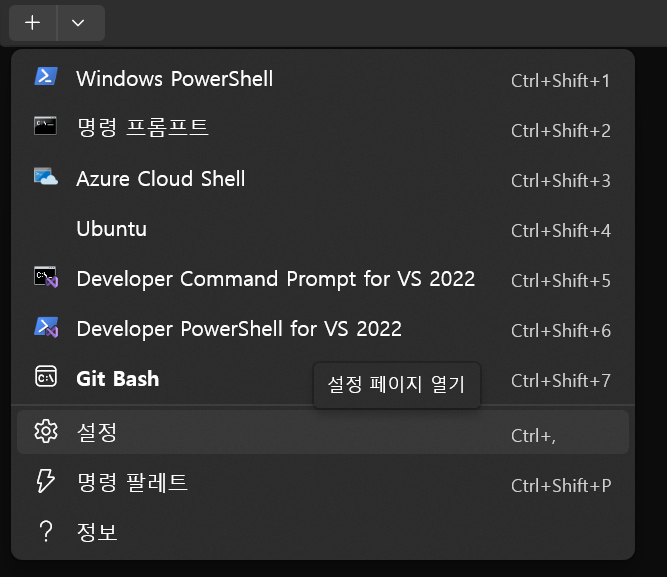
- Git Bash 프로필 추가   
  좌측에서 '새 프로필 추가'를 클릭하고 아래와 같이 입력한 후 저장합니다.   
  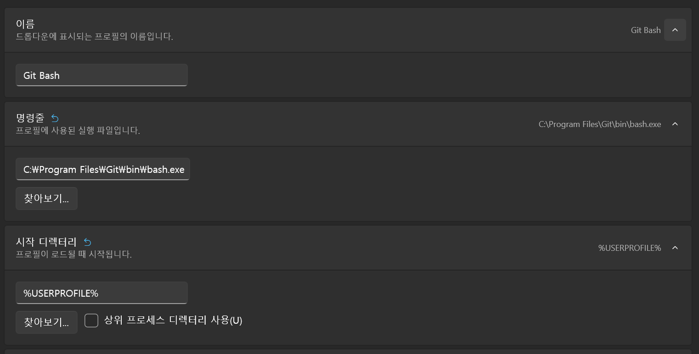
- 기본 프로필 지정    
  좌측에서 '시작' 메뉴 클릭 후, 기본 프로필을 'Git Bash'로 변경합니다.   
  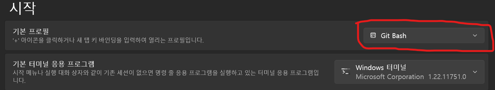

**3.확인**  
설정 후 Window Terminal에서 새창열기에 'Git Bash'가 보여야 합니다.  
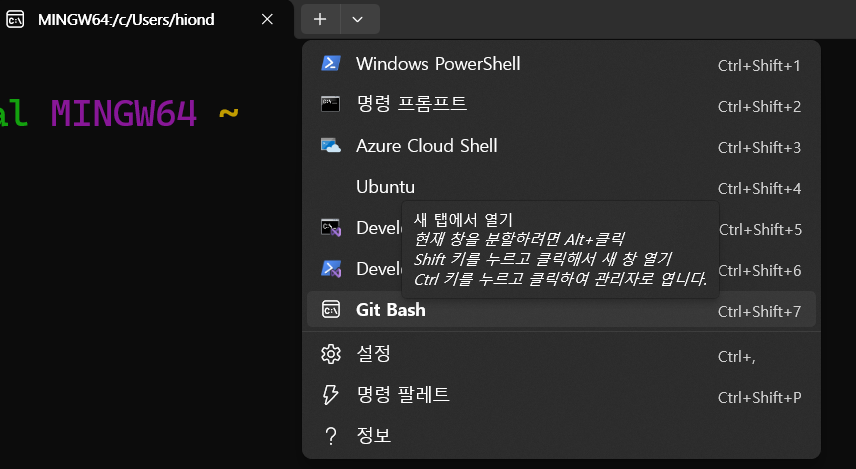

새 창을 열면 기본이 Git Bash로 나오면 됩니다.  


| [Top](#로컬-개발-환경-구성) |

---

## Microsoft Visual Studio Code 설치 
### 설치   
Microsoft Visual Studio Code(vscode라고 많이 부름)는 주로 Javascript, Python과 같은   
Interpreter 언어를 개발할 때 사용하는 IDE(Integrated Development Environment)입니다.  
> **Interpreter 언어**: 통역가라는 직역처럼 별도의 실행파일을 만들지 않고 소스를 바로 실행하는 언어   

다운로드 페이지에 접속하여 설치파일을 다운로드하여 설치: [vscode설치](https://code.visualstudio.com/download) 

### 설정 
- 디렉토리 중첩 표시를 해제 합니다.  
  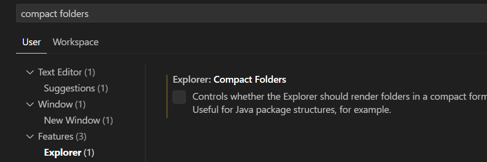

- Markdown Preview Enhanced 플러그인 설치   
  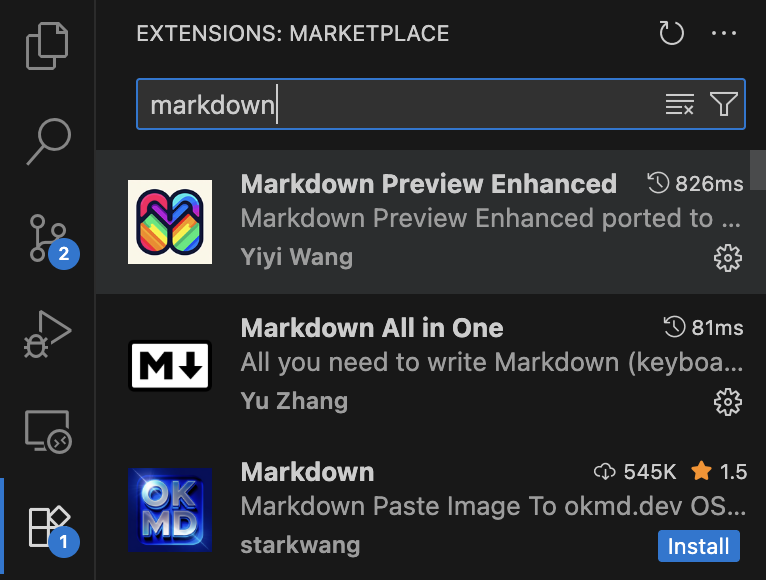

  맥에서는 cmd-shift-v, Windows에서는 ctrl-shift-v로 마크다운 파일을 미리보기 할 수 있습니다.   

| [Top](#로컬-개발-환경-구성) |

---

# 추가 설치
전 과정을 진행하기 위한 추가 설치입니다. 
   
## Node.js 설치
Node.js는 서버 프로그램을 만들수 있는 Javascript 기반 언어입니다.  
Node.js Runtime엔진을 설치합니다.   

- Node.js 설치  
  [Node.js 설치하기](https://nodejs.org/en/)페이지로 접속하여  
  설치파일을 다운로드 받아 설치합니다.   

- 테스트 
  ```
  npm -v
  ```

| [Top](#로컬-개발-환경-구성) |

---

## Python 설치
최신 버전을 설치하세요.  
https://www.python.org/downloads/


| [Top](#로컬-개발-환경-구성) |

---

## IntelliJ 설치
IntelliJ는 통합개발환경(IDE:Integrated Development Environment) 도구의 하나입니다.   
### 설치
- 설치 파일 다운로드
  [JetBrain의 IDE페이지](https://www.jetbrains.com/idea/download)를 열고 설치 

- 실행: 실행 시 IntelliJ 환경설정을 불러들일 위치를 묻는데 그냥 OK클릭   
  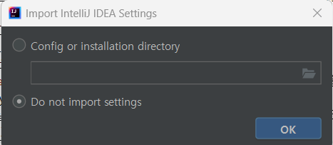

### IntelliJ 환경 설정
- Lombok설치
  Lombok은 클래스의 생성자, Getter(프라퍼티값을 읽는 메소드), Setter(프라퍼티값을 변경하는 메소드)등을    
  자동으로 작성해 주는 라이브러리입니다.    
  Lombok을 사용하면 어노테이션만 지정하면 이러한 메소드들을    
  자동으로 만들어 주기 때문에 편하고 코드도 깔끔해집니다.    

  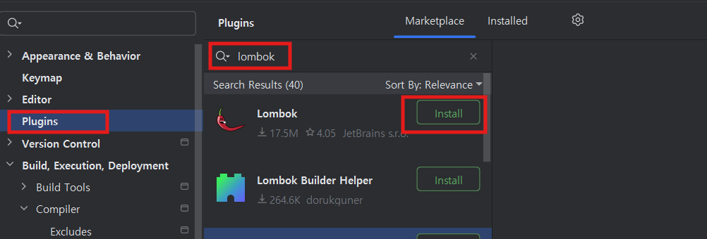

- 라이브러리 자동 import 옵션    
  첫번째 옵션은 코드 작성 중 필요한 라이브러리를 자동 import해 주는 것이고,   
  두번째 옵션은 불필요한 라이브러리 import를 자동으로 제거해 주는 옵션입니다.   
  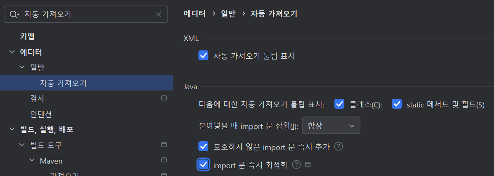

- 오타 검사 옵션 비활성화  
  코드나 주석에 오타를 체크해 주는 옵션입니다.   
  활성화 되어 있으면 컴파일 Warning갯수가 자꾸 보여서 눈에 거슬립니다.   
  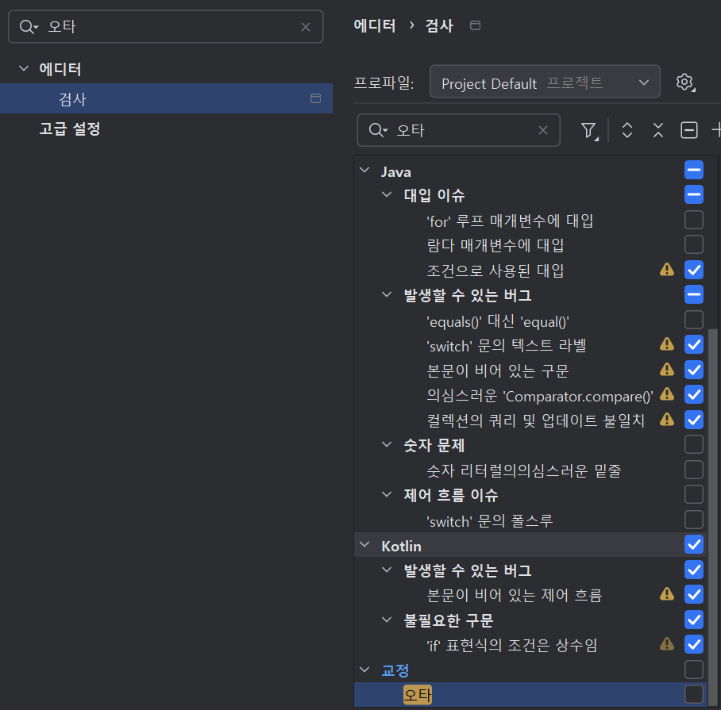 
  
| [Top](#로컬-개발-환경-구성) |

---

## Docker Desktop 설치
- 설치파일 다운로드: 
  - [Docker Desktop for Window](https://docs.docker.com/desktop/install/windows-install/)로 접근하여 다운로드 
  - [Docker Desktop for Mac](https://docs.docker.com/desktop/setup/install/mac-install/)로 접근하여 다운로드    
- 다운로드한 파일을 실행하여 설치: 기본 옵션 그대로 설치   

| [Top](#로컬-개발-환경-구성) |

---

## GitHub 회원가입 및 토큰 생성  
### 회원가입
https://github.com을 여시고 회원 가입을 하십시오.   

### 접근 토큰 생성
Git Repository에 소스를 업로드할 때 사용할 토큰을 생성 하십시오. 
토큰은 잊어 버리지 않게 잘 보관해 놓으십시오.   

우측 상단의 프로파일 이미지를 클릭하고 'Settings'선택


좌측 메뉴에서 맨 아래에 있는 Developer settings 선택
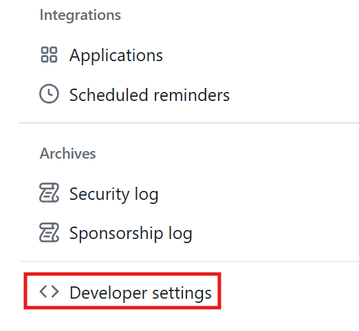

좌측 메뉴에서 'Personal access tokens'를 펼치고 Tokens(classic) 선택
오른쪽에서 'Generate new token' 클릭하고 두번째 것 선택
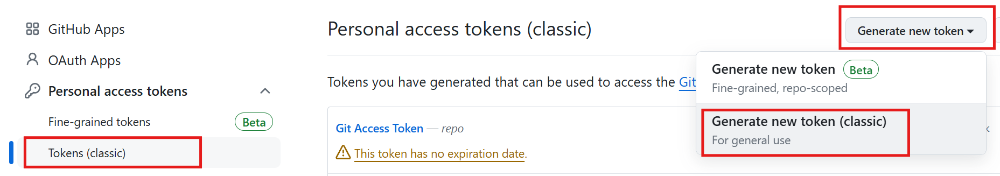

Note(토큰이름: 적절히 지정)를 입력하고 Expiration 기간을 지정한 후 'repo'와 'workflow'를 체크함
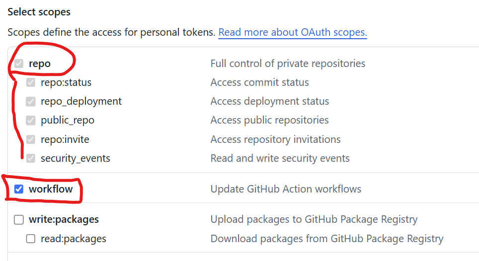

| [Top](#목차) |

---

## Docker HUB 회원가입   
Docker Hub는 컨테이너 이미지를 내려받고 저장할 공개된 이미지 저장소입니다.   
https://hub.docker.com 으로 접근하여 회원가입을 하십시오.   

| [Top](#목차) |

---

## DBeaver 설치(옵션)
DBeaver는 SQL Client 프로그램의 하나입니다.   
Database를 관리하고 SQL로 테이블과 데이터를 처리할 수 있습니다.    

- 설치하기 
  - 설치파일 다운로드: [설치파일 다운로드](https://dbeaver.io/download/) 링크를 열어 OS에 맞는 파일을 다운로드    
  - 파일을 실행하여 설치합니다. 기본 옵션 그대로 설치합니다.   
- 테스트   
  - DBeaver를 실행합니다.  최초 실행 시 Connection생성 창은 닫으세요.   
      
          
  - 테스트로 MySQL Database를 컨테이너로 실행합니다.  
    Windows 사용자는 MobaXTerm, Mac사용자는 터미널에서 실행     
    ```
    docker run -d --name mysql -p 3306:3306 -e MYSQL_ROOT_PASSWORD=P@ssw0rd$ mysql
    ```     

  - 아래와 같이 DB를 연결 합니다.: Root암호는 P@ssw0rd$임(MySQL 컨테이너 실행 시 옵션으로 지정)  
    
    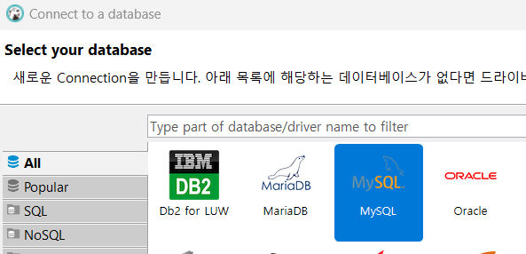  
      
  - Driver파일을 다운로드 한 후 아래와 같이 경고가 나오면  아래를 수행합니다.  
    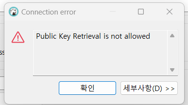  
    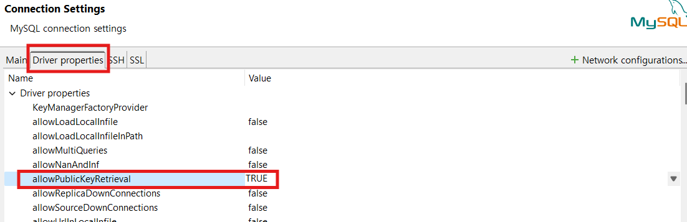    
    
  - 아래와 같이 DB가 연결되면 성공!   
      
   
  - SQL편집기를 테스트 해 봅니다.   
    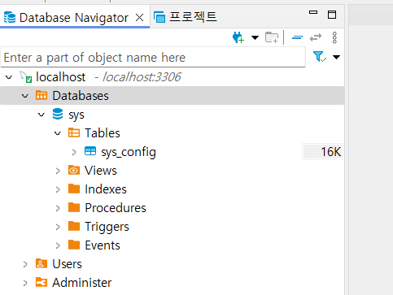
    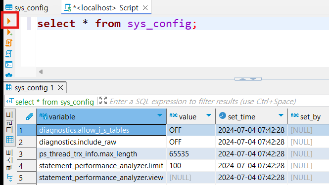
      
| [Top](#목차) |

---


