# 로컬 개발 환경 구성

- [로컬 개발 환경 구성](#로컬-개발-환경-구성)
- [공통 필수 설치](#공통-필수-설치)
  - [GitHub 회원가입](#github-회원가입)
    - [회원가입](#회원가입)
  - [Git Client 설치](#git-client-설치)
    - [설치](#설치)
  - [GitHub CLI (gh) 설치](#github-cli-gh-설치)
    - [설치](#설치-1)
    - [인증](#인증)
    - [설치 확인](#설치-확인)
  - [Node.js 설치](#nodejs-설치)
  - [Microsoft Visual Studio Code 설치](#microsoft-visual-studio-code-설치)
    - [설치](#설치-2)
  - [Claude Code CLI 설치](#claude-code-cli-설치)
    - [설치](#설치-3)
    - [설치확인](#설치확인)
  - [AI툴 설치](#ai툴-설치)
  - [Python 설치](#python-설치)
    - [설치](#설치-4)
    - [Alias 등록(Mac 사용자만 수행)](#alias-등록mac-사용자만-수행)
- [설계 단계를 위한 추가 설치](#설계-단계를-위한-추가-설치)
  - [Docker Desktop 설치](#docker-desktop-설치)
- [개발/배포 단계를 위한 추가 설치](#개발배포-단계를-위한-추가-설치)
  - [Docker HUB 회원가입](#docker-hub-회원가입)
  - [IntelliJ 설치](#intellij-설치)
    - [설치](#설치-5)
    - [IntelliJ 환경 설정](#intellij-환경-설정)

---

# 공통 필수 설치   
기본적으로 설치해야 하는 공통 필수 설치    

## GitHub 회원가입 
### 회원가입
https://github.com 여시고 회원 가입을 하십시오.   

| [Top](#로컬-개발-환경-구성) |
  

## Git Client 설치
### 설치
`git -v` 명령으로 설치여부 검사하여 미설치 시   
[Git Client 설치하기](https://git-scm.com/downloads)에 접속하여 설치파일을 다운로드 받아 설치합니다.   
  

| [Top](#로컬-개발-환경-구성) |

---

## GitHub CLI (gh) 설치
GitHub CLI는 터미널에서 GitHub 레포지토리 생성, PR, Issue 등을 관리할 수 있는 도구입니다.
※ 설치 실패 시 Skip 

### 설치
`gh --version` 명령으로 설치 여부를 확인하여 미설치 시 아래 방법으로 설치합니다.

**Windows: Powershell에서 수행**
```
winget install --id GitHub.cli
```

**Mac**: 
Homebrew 설치   
설치여부 검사: brew -v   
미 설치 시 아래 명령으로 설치 
```
/bin/bash -c "$(curl -fsSL https://raw.githubusercontent.com/Homebrew/install/HEAD/install.sh)"
```
설치 후 PATH 추가  
```
echo 'eval "$(/opt/homebrew/bin/brew shellenv)"' >> ~/.zprofile
eval "$(/opt/homebrew/bin/brew shellenv)"
```

터미널을 재시작하여 아래 명령으로 설치 확인  
```
brew -v 
```

gh 설치:   
```
brew install gh
```

**Linux**
```
(type -p wget >/dev/null || (sudo apt update && sudo apt-get install wget -y)) \
  && sudo mkdir -p -m 755 /etc/apt/keyrings \
  && out=$(mktemp) && wget -nv -O$out https://cli.github.com/packages/githubcli-archive-keyring.gpg \
  && cat $out | sudo tee /etc/apt/keyrings/githubcli-archive-keyring.gpg > /dev/null \
  && sudo chmod go+r /etc/apt/keyrings/githubcli-archive-keyring.gpg \
  && echo "deb [arch=$(dpkg --print-architecture) signed-by=/etc/apt/keyrings/githubcli-archive-keyring.gpg] https://cli.github.com/packages stable main" | sudo tee /etc/apt/sources.list.d/github-cli.list > /dev/null \
  && sudo apt update \
  && sudo apt install gh -y
```

### 인증
```
gh auth login
```
프롬프트 안내에 따라 GitHub.com > HTTPS > 브라우저 인증을 선택합니다.    
인증은 Web Browser로 수행   
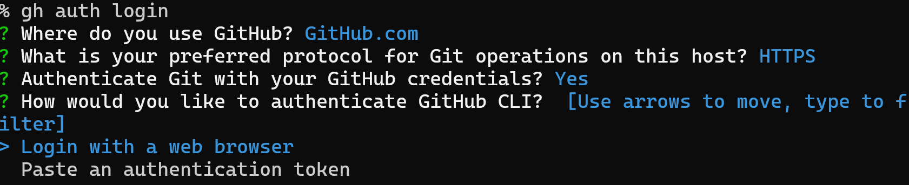   

아래 화면 나오면 터미널로 돌아가서 인증코드 복사하여 웹 브라우저 인증코드 입력란에 붙이세요.   
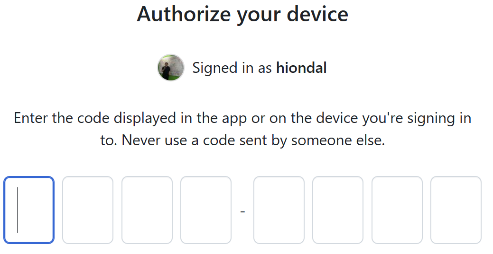        
  
    
  
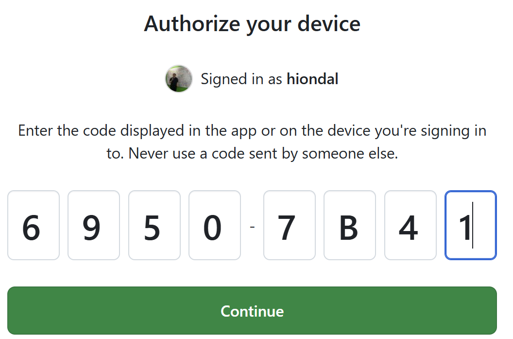     
  
### 설치 확인
```
gh --version
gh auth status
```

| [Top](#로컬-개발-환경-구성) |

---

## Node.js 설치
Node.js는 서버 프로그램을 만들수 있는 Javascript 기반 언어입니다.  
Node.js Runtime엔진을 설치합니다.   

- Node.js 설치  
  [Node.js 설치하기](https://nodejs.org/en/)페이지로 접속하여  
  설치파일을 다운로드 받아 설치합니다.   

- 테스트 
  ```
  npm -v
  ```

| [Top](#로컬-개발-환경-구성) |

---

## Microsoft Visual Studio Code 설치 
### 설치   
Microsoft Visual Studio Code(vscode라고 많이 부름)는 주로 Javascript, Python과 같은   
Interpreter 언어를 개발할 때 사용하는 IDE(Integrated Development Environment)입니다.  
> **Interpreter 언어**: 통역가라는 직역처럼 별도의 실행파일을 만들지 않고 소스를 바로 실행하는 언어   

다운로드 페이지에 접속하여 설치파일을 다운로드하여 설치: [vscode설치](https://code.visualstudio.com/download) 


| [Top](#로컬-개발-환경-구성) |

---

## Claude Code CLI 설치  
### 설치
**Linux/Mac**     
```bash
# macOS/Linux
curl -fsSL https://claude.ai/install.sh | bash
```

**Windows**     
PowerShell에서 수행합니다.   
```
irm https://claude.ai/install.ps1 | iex
```

터미널을 재시작한 후 설치 확인 합니다.   

### 설치확인   
아래 명령 수행하여 에러 안 나면 설치 성공    
```
claude 
```

| [Top](#로컬-개발-환경-구성) |

---

## AI툴 설치  
사용할 AI툴을 설치 합니다.   
  
**1)Claude Desktop 설치**      
Claude Web 접근    
https://claude.ai
  
좌측 하단의 본인 이름 클릭      
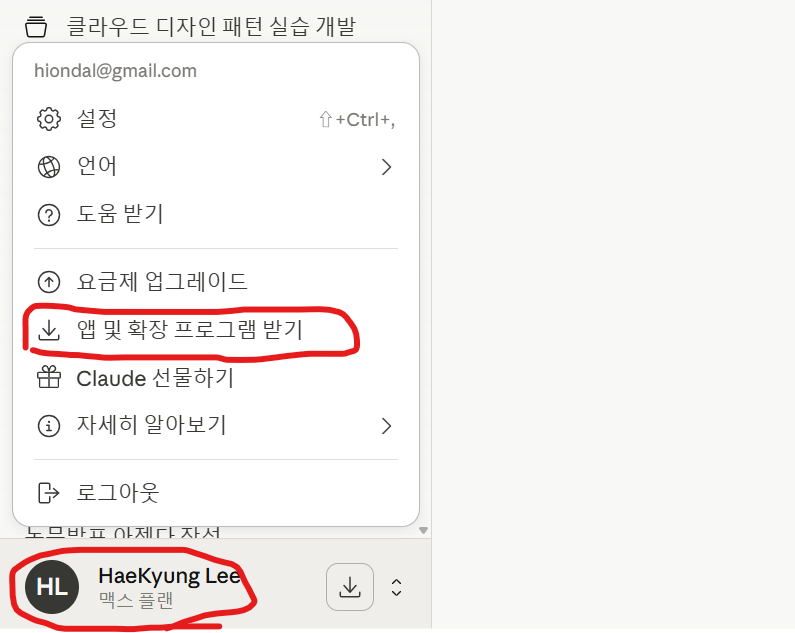   
   
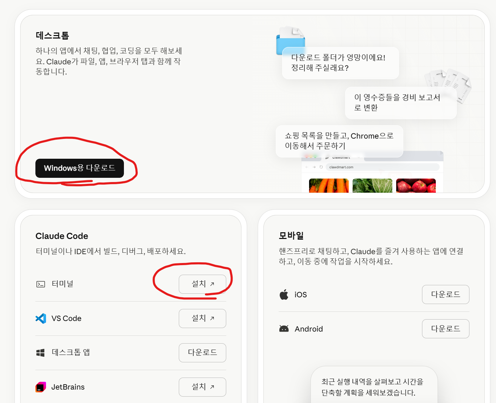
  
**2)Cursor 설치**        
아래 사이트에서 설치 프로그램 다운로드해서 설치하세요.   
https://cursor.com/

| [Top](#로컬-개발-환경-구성) |

**Cursor 환경설정:**          
- Cursor 가입: 위 Cursor 사이트에서 회원가입 및 Pro 구독   
- 로그인
  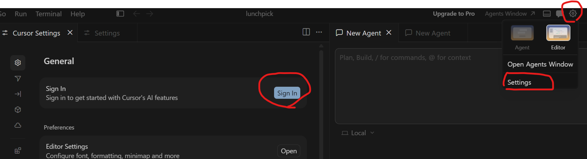    
- Auto-Run Mode 활성화: 작업 시 매번 승인 안 물어보게 셋팅
  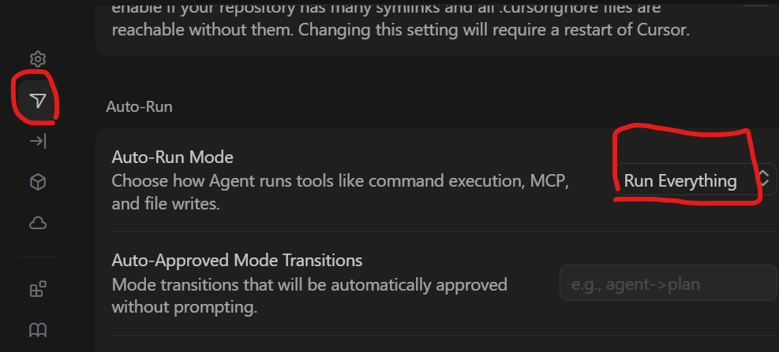

**3)Codex 설치**   

https://developers.openai.com/codex/app

**Codex CLI설치:**      
https://developers.openai.com/codex/cli

**4)Antigravity 설치**        
https://antigravity.google/download

---

## Python 설치

### 설치  
기존 설치 여부 체크   
```
python --version   
```
3.13이상 버전 설치를 권고합니다.      
  
자신의 OS에 맞는 3.13 버전을 설치하세요.  
https://www.python.org/downloads/release/python-31313/

3.13 버전 페이지의 하단에서 자신의 OS에 맞는 installer 다운로드하여 설치하세요.   
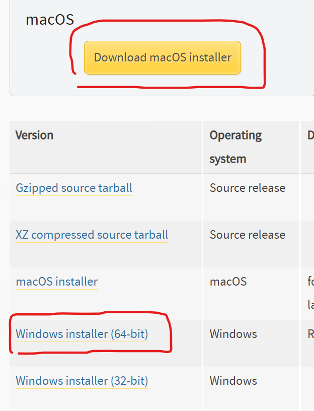

(중요) 윈도우 사용자는 설치 시 'Add python.exe to PATH'를 반드시 체크하고 설치   
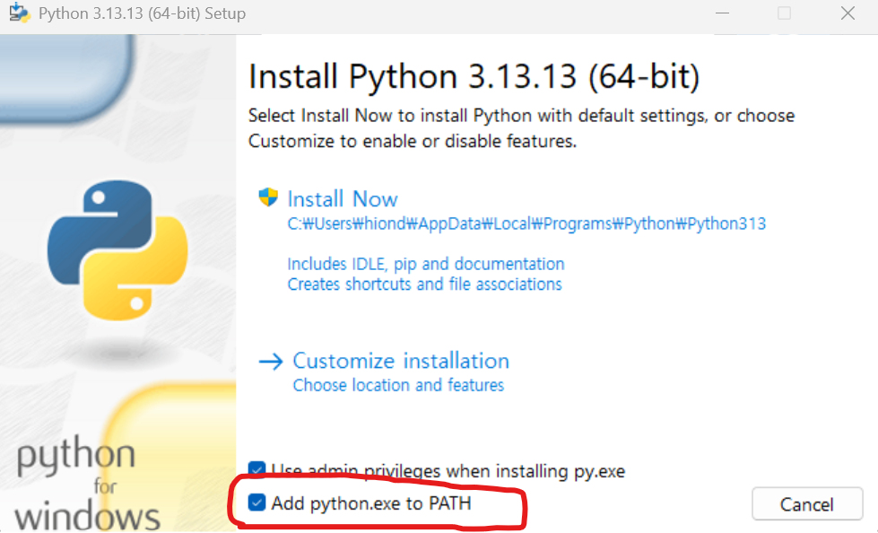
  
### Alias 등록(Mac 사용자만 수행)
아래 명령 수행 시 에러가 나거나 3.13설치했는데 다른 버전 나올 때만 수행합니다.   
```
python --version
```
  
```
code ~/.zshrc
```
맨 하단에 아래 추가
```
# python 
alias python=python3.13
alias pip=pip3
```
설정 적용  
```
source ~/.zshrc
```

테스트
```
python --version
pip --version
```


| [Top](#로컬-개발-환경-구성) |

---

# 설계 단계를 위한 추가 설치  

## Docker Desktop 설치
- 설치파일 다운로드: 
  - [Docker Desktop for Window](https://docs.docker.com/desktop/install/windows-install/)로 접근하여 다운로드 
  - [Docker Desktop for Mac](https://docs.docker.com/desktop/setup/install/mac-install/)로 접근하여 다운로드    
- 다운로드한 파일을 실행하여 설치: 기본 옵션 그대로 설치   

| [Top](#로컬-개발-환경-구성) |

---

# 개발/배포 단계를 위한 추가 설치
모든 과정을 진행하기 위한 추가 설치입니다. 
개발과 배포 과정까지 진행하려면 추가 설치하세요.    


## Docker HUB 회원가입   
Docker Hub는 컨테이너 이미지를 내려받고 저장할 공개된 이미지 저장소입니다.   
https://hub.docker.com 으로 접근하여 회원가입을 하십시오.   

| [Top](#로컬-개발-환경-구성) |

---

## IntelliJ 설치
IntelliJ는 통합개발환경(IDE:Integrated Development Environment) 도구의 하나입니다.   
### 설치
- 설치 파일 다운로드
  [JetBrain의 IDE페이지](https://www.jetbrains.com/idea/download)를 열고 설치 

- 실행: 실행 시 IntelliJ 환경설정을 불러들일 위치를 묻는데 그냥 OK클릭   
  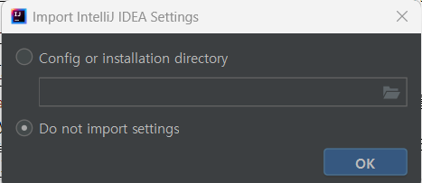

### IntelliJ 환경 설정
- Lombok설치
  Lombok은 클래스의 생성자, Getter(프라퍼티값을 읽는 메소드), Setter(프라퍼티값을 변경하는 메소드)등을    
  자동으로 작성해 주는 라이브러리입니다.    
  Lombok을 사용하면 어노테이션만 지정하면 이러한 메소드들을    
  자동으로 만들어 주기 때문에 편하고 코드도 깔끔해집니다.    

  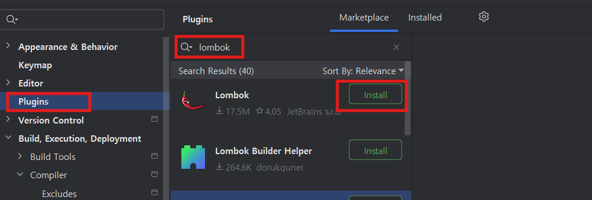

- 라이브러리 자동 import 옵션    
  첫번째 옵션은 코드 작성 중 필요한 라이브러리를 자동 import해 주는 것이고,   
  두번째 옵션은 불필요한 라이브러리 import를 자동으로 제거해 주는 옵션입니다.   
  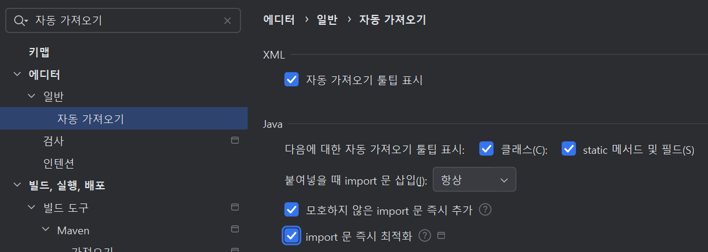

- 오타 검사 옵션 비활성화  
  코드나 주석에 오타를 체크해 주는 옵션입니다.   
  활성화 되어 있으면 컴파일 Warning갯수가 자꾸 보여서 눈에 거슬립니다.   
  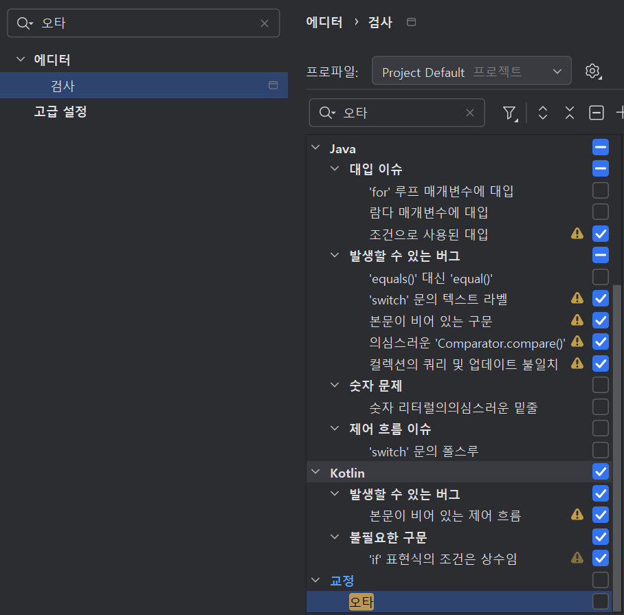 
  
| [Top](#로컬-개발-환경-구성) |

---
