# Mermaid문법검사가이드

## 개요

Mermaid 다이어그램의 문법 오류를 사전에 검출하여 렌더링 실패를 방지하기 위한 가이드입니다. Docker 기반 Mermaid CLI를 활용하여 로컬에서 빠르게 문법을 검증할 수 있습니다.

## Mermaid CLI 서버 설치 및 검사

### Docker로 Mermaid CLI 컨테이너 실행

```bash
# Mermaid CLI 컨테이너가 실행 중인지 확인
docker ps | grep mermaid-cli

# ⚠️ 중요: 첫 실행 시 이미지 다운로드를 먼저 진행 (큰 이미지로 인한 타임아웃 방지)
docker pull minlag/mermaid-cli:latest

# Mermaid CLI 컨테이너가 없으면 설치 및 실행 (root 권한으로 실행, 포트 48080 사용)
docker run -d --rm --name mermaid-cli -u root -p 48080:8080 --entrypoint sh minlag/mermaid-cli:latest -c "while true;do sleep 3600; done"

# 컨테이너 상태 확인
docker logs mermaid-cli
```

#### 💡 Docker 이미지 다운로드 관련 주의사항

**첫 실행 시 발생할 수 있는 문제:**
- `minlag/mermaid-cli:latest` 이미지가 큰 용량(약 700MB+)이므로 다운로드에 시간이 오래 걸림
- `docker run` 명령 실행 시 이미지가 없으면 자동 다운로드하지만 타임아웃 발생 가능
- **해결방법**: `docker pull` 명령으로 이미지를 먼저 다운로드한 후 컨테이너 실행

**권장 실행 순서:**
1. `docker pull minlag/mermaid-cli:latest` (이미지 다운로드)
2. `docker run` 명령으로 컨테이너 실행
3. 필수 설정 진행

#### ⚠️ 중요: 최초 컨테이너 생성 후 필수 설정

Mermaid CLI는 Puppeteer를 사용하여 다이어그램을 렌더링하므로 Chromium 브라우저가 필요합니다. 
컨테이너를 처음 생성한 후 다음 명령을 실행하여 필요한 패키지를 설치해야 합니다:

```bash
# Chromium 및 필요한 종속성 설치
docker exec mermaid-cli sh -c "apk add --no-cache chromium chromium-chromedriver nss freetype harfbuzz ca-certificates ttf-freefont"

# Puppeteer가 사용할 설정 파일 생성
docker exec mermaid-cli sh -c "echo '{\"executablePath\": \"/usr/bin/chromium-browser\", \"args\": [\"--no-sandbox\", \"--disable-setuid-sandbox\", \"--disable-dev-shm-usage\"]}' > /tmp/puppeteer-config.json"
```

이 설정은 컨테이너가 실행되는 동안 유지되므로 한 번만 실행하면 됩니다.

문법검사 후 Container를 중지하지 않고 계속 사용함 

## 문법 검사 방법
현재 OS에 맞게 수행.

### Linux/macOS 버전
**스크립트 파일(tools/check-mermaid.sh)을 이용하여 수행**

1. tools/check-mermaid.sh 파일 존재 여부 확인 
2. 스크립트 파일이 없으면 "Mermaid문법검사기(Linux/Mac)"를 tools/check-mermaid.sh 파일로 다운로드하여 스크립트 파일을 만듦
3. 스크립트 파일이 있으면 그 스크립트 파일을 이용하여 검사

```bash
# 1. 스크립트 실행 권한 부여 (최초 1회)
chmod +x tools/check-mermaid.sh

# 2. 문법 검사 실행
./tools/check-mermaid.sh {검사할 파일}

# 예시
./tools/check-mermaid.sh design/backend/physical/physical-architecture.mmd
```

### Windows PowerShell 버전
**스크립트 파일(tools/check-mermaid.ps1)을 이용하여 수행**

1. tools/check-mermaid.ps1 파일 존재 여부 확인 
2. 스크립트 파일이 없으면 "Mermaid문법검사기(Window)"를 tools/check-mermaid.ps1 파일로 다운로드하여 스크립트 파일을 만듦
3. 스크립트 파일이 있으면 그 스크립트 파일을 이용하여 검사

```powershell
# 문법 검사 실행
.\tools\check-mermaid.ps1 {검사할 파일}

# 예시
.\tools\check-mermaid.ps1 design\backend\physical\physical-architecture.mmd
```

### 수동 검사 방법 (스크립트 없이)

```bash
# 1. 고유 파일명 생성 (충돌 방지)
TEMP_FILE="/tmp/mermaid_$(date +%s)_$$.mmd"

# 2. 파일 복사
docker cp {검사할 파일} mermaid-cli:${TEMP_FILE}

# 3. 문법 검사 (Puppeteer 설정 파일 사용)
docker exec mermaid-cli sh -c "cd /home/mermaidcli && node_modules/.bin/mmdc -i ${TEMP_FILE} -o /tmp/output.svg -p /tmp/puppeteer-config.json -q"

# 4. 임시 파일 삭제
docker exec mermaid-cli rm -f ${TEMP_FILE} /tmp/output.svg
```

**주의**: Puppeteer 설정 파일(`/tmp/puppeteer-config.json`)이 있어야 합니다. 없다면 위의 "최초 컨테이너 생성 후 필수 설정"을 먼저 실행하세요.

### 검사 결과 해석

| 출력 | 의미 | 대응 방법 |
|------|------|-----------|
| "Success: Mermaid syntax is valid!" | 문법 오류 없음 ✅ | 정상, 렌더링 가능 |
| "Parse error on line X" | X번째 줄 구문 오류 ❌ | 해당 라인 문법 확인 |
| "Expecting 'XXX'" | 예상 토큰 오류 ❌ | 누락된 문법 요소 추가 |
| "Syntax error" | 일반 문법 오류 ❌ | 전체 구조 재검토 |

## Mermaid 다이어그램 타입별 주의사항

### 1. Graph/Flowchart

```mermaid
graph TB
    %% 올바른 사용법 ✅
    A[Node A] --> B[Node B]
    C[Node C] -.-> D[Node D]
    E[Node E] ==> F[Node F]
    
    %% 주의사항
    %% - 노드 ID에 공백 불가 (대신 [Label] 사용)
    %% - subgraph와 end 개수 일치 필요
    %% - 따옴표 안에서 특수문자 주의
```


### 2. Sequence Diagram

```mermaid
sequenceDiagram
    %% 올바른 사용법 ✅
    participant A as Service A
    participant B as Service B
    
    A->>B: Request
    B-->>A: Response
    A->>+B: Call with activation
    B-->>-A: Return with deactivation
    
    %% 주의사항
    %% - participant 선언 권장
    %% - 활성화(+)/비활성화(-) 쌍 맞추기
    %% - Note 블록 종료 확인
```


### 3. Class Diagram

```mermaid
classDiagram
    %% 올바른 사용법 ✅
    class Animal {
        +String name
        +int age
        +makeSound() void
    }
    
    class Dog {
        +String breed
        +bark() void
    }
    
    Animal <|-- Dog : inherits
    
    %% 주의사항
    %% - 메서드 괄호 필수
    %% - 관계 표현 정확히
    %% - 접근 제한자 기호 확인
```


### 4. State Diagram

```mermaid
stateDiagram-v2
    %% 올바른 사용법 ✅
    [*] --> Idle
    Idle --> Processing : start
    Processing --> Completed : finish
    Processing --> Error : error
    Error --> Idle : reset
    Completed --> [*]
    
    %% 주의사항
    %% - [*]는 시작/종료 상태
    %% - 상태 이름에 공백 불가
    %% - 전이 레이블 콜론(:) 사용
```


## 일반적인 오류와 해결 방법

### 1. 괄호 불균형
```mermaid
%% 잘못된 예 ❌
graph TB
    A[Node (with parenthesis)]  %% 괄호 안에 괄호
    
%% 올바른 예 ✅
graph TB
    A[Node with parenthesis]
```

### 2. 특수 문자 이스케이프
```mermaid
%% 잘못된 예 ❌
graph TB
    A[Security & Management]  %% & 문자 직접 사용
    
%% 올바른 예 ✅
graph TB
    A[Security &amp; Management]  %% HTML 엔티티 사용
```

### 3. subgraph/end 불일치
```mermaid
%% 잘못된 예 ❌
graph TB
    subgraph One
        A --> B
        subgraph Two
            C --> D
    end  %% Two만 닫힘, One은 안 닫힘
    
%% 올바른 예 ✅
graph TB
    subgraph One
        A --> B
        subgraph Two
            C --> D
        end
    end  %% 모든 subgraph 닫기
```

### 4. 노드 참조 오류
```mermaid
%% 잘못된 예 ❌
graph TB
    A --> UnknownNode  %% 정의되지 않은 노드
    
%% 올바른 예 ✅
graph TB
    A[Node A] --> B[Node B]  %% 모든 노드 정의
```

## 컨테이너 관리

### 컨테이너 중지 및 삭제
```bash
# 컨테이너 중지
docker stop mermaid-cli

# 컨테이너 삭제
docker rm mermaid-cli

# 한 번에 중지 및 삭제
docker stop mermaid-cli && docker rm mermaid-cli
```

### 컨테이너 재시작
```bash
# 컨테이너 재시작
docker restart mermaid-cli
```

## 성능 최적화 팁

1. **컨테이너 유지**: 검사 후 컨테이너를 중지하지 않고 유지하여 다음 검사 시 빠르게 실행
2. **배치 검사**: 여러 파일을 연속으로 검사할 때 컨테이너 재시작 없이 진행
3. **로컬 파일 사용**: 네트워크 경로보다 로컬 파일 경로 사용 권장

## 문제 해결

### Docker 관련 오류
```bash
# Docker 데몬 실행 확인
docker ps

# Docker Desktop 시작 (Windows/Mac)
# Docker 서비스 시작 (Linux)
sudo systemctl start docker
```

### 권한 오류
```bash
# Linux/Mac에서 스크립트 실행 권한
chmod +x tools/check-mermaid.sh

# Docker 권한 (Linux)
sudo usermod -aG docker $USER
```

### 컨테이너 이미지 오류
```bash
# 이미지 재다운로드
docker pull minlag/mermaid-cli:latest

# 기존 컨테이너 삭제 후 재생성
docker stop mermaid-cli && docker rm mermaid-cli
```