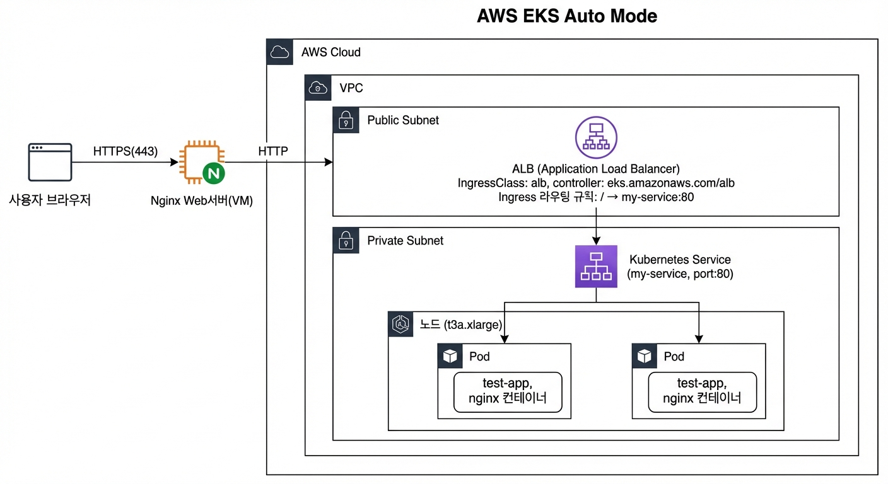

# CLOUD별 k8s 생성 

- [CLOUD별 k8s 생성](#cloud별-k8s-생성)
- [Web서버 설치](#web서버-설치)
  - [Web Server용 VM 생성](#web-server용-vm-생성)
  - [nginx 서버 설치](#nginx-서버-설치)
  - [SSL 설정](#ssl-설정)
- [AWS](#aws)
  - [시작](#시작)
  - [클러스터 생성](#클러스터-생성)
  - [클러스터 생성 확인](#클러스터-생성-확인)
  - [Credential 획득](#credential-획득)
  - [ALB 설정](#alb-설정)
    - [Subnet에 Tag 등록](#subnet에-tag-등록)
    - [IngressClass 객체 생성](#ingressclass-객체-생성)
  - [커스텀 노드풀(NodePool) 생성](#커스텀-노드풀nodepool-생성)
  - [테스트](#테스트)
  - [비용절감을 위한 팁](#비용절감을-위한-팁)
- [Azure](#azure)
  - [시작](#시작-1)
  - [클러스터 생성](#클러스터-생성-1)
    - [Portal에서 생성](#portal에서-생성)
  - [Credential 획득](#credential-획득-1)
  - [Ingress 설정](#ingress-설정)
  - [커스텀 노드풀(NodePool) 생성](#커스텀-노드풀nodepool-생성-1)
  - [테스트](#테스트-1)
  - [비용절감을 위한 팁](#비용절감을-위한-팁-1)
    - [클러스터 삭제](#클러스터-삭제)


---

# Web서버 설치
외부에서 http[s]로 접근 시 Web서버 -> LB(Load Balancer) -> Ingress -> Service -> Pod로 접속합니다.  
이렇게 Web서버를 통해 접근하면 쉽게 사용자 친숙한 도메인과 SSL 사용을 할 수 있어 편합니다.     
```
사용자
    ↓ web서버 주소(예: https://myapp.example.com)
Nginx (온프레미스 or 공통 서버)
    ↓
    ├── AWS EKS ALB
    ├── Azure AKS LB
    └── GCP GKE LB
```

## Web Server용 VM 생성  
사용하는 CLOUD 서비스에서 Web server용 VM을 생성합니다.  
https://github.com/unicorn-plugins/npd/blob/main/resources/references/create-vm.md

그리고 ~/.ssh/config에 지정한대로 ssh {alias}로 VM을 접속합니다.   

## nginx 서버 설치  
Web서버 VM에서 수행합니다.  
- Nginx 설치

  ```
  sudo apt update
  sudo apt install nginx -y
  ```

  ```
  sudo systemctl start nginx
  sudo systemctl enable nginx
  ```

  ```
  sudo systemctl status nginx
  ```

- Nginx 환경설정
  
  기존 '/etc/nginx/nginx.conf' 파일을 변경합니다.     
  ```
  cat << 'EOF' | sudo tee /etc/nginx/nginx.conf
  user www-data;
  worker_processes auto;
  pid /run/nginx.pid;
  events {
    worker_connections 768;
  }
  http {
    sendfile on;
    tcp_nopush on;
    tcp_nodelay on;
    keepalive_timeout 65;
    types_hash_max_size 2048;
    include /etc/nginx/mime.types;
    default_type application/octet-stream;
    access_log /var/log/nginx/access.log;
    error_log /var/log/nginx/error.log;
    gzip on;
    include /etc/nginx/conf.d/*.conf;
    include /etc/nginx/sites-enabled/*;
  }
  EOF
  ```
  
  80포트에 대한 설정을 합니다.  
  ```
  cat << 'EOF' | sudo tee /etc/nginx/sites-available/default
  server {
    listen 80;
    server_name _;
    root /var/www/html;
    index index.html;
    location / {
        try_files $uri $uri/ =404;
    }
  }
  EOF
  ```

  설정이 적용 되려면 '/etc/nginx/sites-enabled'에 링크를 만들어야 합니다.  
  ```
  sudo rm -f /etc/nginx/sites-enabled/default
  sudo ln -s /etc/nginx/sites-available/default /etc/nginx/sites-enabled/
  ```

  설정에 문제가 없는지 테스트 하고 nginx서버를 재시작 합니다.  
  ```
  sudo nginx -t
  sudo systemctl reload nginx
  ```

- 테스트

  ```  
  cat << 'EOF' | sudo tee /var/www/html/index.html
  <!DOCTYPE html>
  <html lang="en">
  <head>
    <meta charset="UTF-8">
    <meta name="viewport" content="width=device-width, initial-scale=1.0">
    <title>Welcome to My Website</title>
    <style>
      body {
        font-family: Arial, sans-serif;
        margin: 0;
        padding: 0;
        background-color: #f4f4f9;
        color: #333;
        text-align: center;
      }
      header {
        background-color: #0078d7;
        color: white;
        padding: 1rem 0;
      }
      main {
        padding: 2rem;
      }
      footer {
        margin-top: 2rem;
        background-color: #333;
        color: white;
        padding: 1rem 0;
        font-size: 0.8rem;
      }
    </style>
  </head>
  <body>
    <header>
      <h1>Welcome to My Website</h1>
      <p>This is a simple HTML page</p>
    </header>
    <main>
      <h2>Hello, World!</h2>
      <p>Thank you for visiting. This page is styled with basic CSS.</p>
    </main>
    <footer>
      &copy; My Website. All rights reserved.
    </footer>
  </body>
  </html>
  EOF
  ```

  웹브라우저에서 'http://{VM Public IP}'로 접근하여 정상적으로 표시되는지 확인합니다.  

---

## SSL 설정  

- 정식 SSL 인증서 받기  
  인증서 생성 프로그램 설치: sudo certbot --version 으로 설치여부 확인    
  ```
  sudo apt update
  sudo apt install snapd
  sudo snap install --classic certbot
  sudo ln -s /snap/bin/certbot /usr/bin/certbot
  ```
 
- SSL 인증서 만들기  
  '{domain}'은 위 SSL설정의 'server_name'에 지정한 {본인ID}.{VM Public IP}.nip.io을 사용합니다.   
  '*.nip.io'는 DNS서버가 없을 때 사용하는 와일드 카드 도메인입니다.   

  ```
  sudo certbot --nginx -d {domain}
  ```
  결과 예시)
  ```
  azureuser@dg0100-bastion:/etc/nginx/sites-available$ sudo certbot --nginx -d dg0100.4.217.252.231.nip.io
  Saving debug log to /var/log/letsencrypt/letsencrypt.log
  Enter email address (used for urgent renewal and security notices)
  (Enter 'c' to cancel): hiondal@gmail.com

  - - - - - - - - - - - - - - - - - - - - - - - - - - - - - - - - - - - - - - - -
  Please read the Terms of Service at
  https://letsencrypt.org/documents/LE-SA-v1.4-April-3-2024.pdf. You must agree in
  order to register with the ACME server. Do you agree?
  - - - - - - - - - - - - - - - - - - - - - - - - - - - - - - - - - - - - - - - -
  (Y)es/(N)o: Y

  - - - - - - - - - - - - - - - - - - - - - - - - - - - - - - - - - - - - - - - -
  Would you be willing, once your first certificate is successfully issued, to
  share your email address with the Electronic Frontier Foundation, a founding
  partner of the Let's Encrypt project and the non-profit organization that
  develops Certbot? We'd like to send you email about our work encrypting the web,
  EFF news, campaigns, and ways to support digital freedom.
  - - - - - - - - - - - - - - - - - - - - - - - - - - - - - - - - - - - - - - - -
  (Y)es/(N)o: Y  
  Account registered.
  Requesting a certificate for dg0100.4.217.252.231.nip.io

  Successfully received certificate.
  Certificate is saved at: /etc/letsencrypt/live/dg0100.4.217.252.231.nip.io/fullchain.pem
  Key is saved at:         /etc/letsencrypt/live/dg0100.4.217.252.231.nip.io/privkey.pem
  This certificate expires on 2025-05-01.
  These files will be updated when the certificate renews.
  Certbot has set up a scheduled task to automatically renew this certificate in the background.

  Deploying certificate
  Could not install certificate

  NEXT STEPS:
  - The certificate was saved, but could not be installed (installer: nginx). After fixing the error shown below, try installing it again by running:
    certbot install --cert-name dg0100.4.217.252.231.nip.io

  Could not automatically find a matching server block for dg0100.4.217.252.231.nip.io. Set the `server_name` directive to use the Nginx installer.
  Ask for help or search for solutions at https://community.letsencrypt.org. See the logfile /var/log/letsencrypt/letsencrypt.log or re-run Certbot with -v for more details.
  ```

- nginx 설정 수정  
  SSL 설정을 추가합니다.    
  http(80포트) 요청은 https(443포트)으로 리다이렉션 시키고 Proxy 설정을 추가합니다.    
  'SERVER_NAME'은 {본인ID}.{VM Public IP}.nip.io로 지정합니다.   
  SSK Key 파일의 경로는 위 SSL 인증서 생성 결과 마지막 쯤에 있는 값과 동일하게 설정합니다.  
  바꾸지 않았다면 '/etc/letsencrypt/live/${SERVER_NAME}' 디렉토리에 있습니다.    
  'location' 섹션은 proxying을 위한 설정입니다. 이는 나중에 사용하니 아래 내용처럼 'proxy_pass'를 일단 리마크합니다.      
  PROXY_TARGET은 Proxying할 때 사용하니 일단 리마크합니다.  
    
  ```
  # 변수 설정
  SERVER_NAME="web.43.201.25.39.nip.io"
  #PROXY_TARGET="http://k8s-default-myingres-3824ba4d1c-969790066.ap-northeast-2.elb.amazonaws.com"

  cat << EOF | sudo tee /etc/nginx/sites-available/default
  # 80 → 443 리다이렉트
  server {
    listen 80;
    server_name ${SERVER_NAME};
    return 301 https://\$host\$request_uri;
  }

  # 443 Proxy
  server {
    listen 443 ssl;
    server_name ${SERVER_NAME};
    ssl_certificate /etc/letsencrypt/live/${SERVER_NAME}/fullchain.pem;
    ssl_certificate_key /etc/letsencrypt/live/${SERVER_NAME}/privkey.pem;
    ssl_protocols TLSv1.2 TLSv1.3;
    ssl_ciphers HIGH:!aNULL:!MD5;
    root /var/www/html;
    index index.html;

    location / {
      //proxy_pass ${PROXY_TARGET};
      proxy_ssl_verify off;
      proxy_buffer_size 64k;
      proxy_buffers 4 64k;
      proxy_busy_buffers_size 64k;
      proxy_set_header Host \$host;
      proxy_set_header X-Real-IP \$remote_addr;
      proxy_set_header X-Forwarded-For \$proxy_add_x_forwarded_for;
      proxy_set_header X-Forwarded-Proto \$scheme;
      proxy_read_timeout 60s;
      proxy_connect_timeout 60s;
      proxy_send_timeout 60s;
    }
  }
  EOF
  ```

- nginx 서버 재시작  
  ```
  sudo nginx -t
  sudo systemctl reload nginx
  ```

- 테스트  
  웹브라우저에서 'https://{domain}'로 접근하여 정상적으로 표시되는지 확인합니다.    

---

# AWS
## 시작
- 상단 검색바에 'EKS'입력하여 'Elastic Kubernetes Service' 선택
- 우측의 '클러스터 생성' 클릭
  
## 클러스터 생성
Auto Mode로 EKS를 생성합니다.   
Auto Mode는 k8s Control Plane(실제 서비스가 배포되는 Worker 노드들을 관리하는 노드)을 AWS가 알아서 관리해주는 모드입니다.   
```
EKS Auto Mode = "인프라는 AWS가, 앱은 내가" 
  
기존 EKS                        EKS Auto Mode
──────────────────────────────────────────────
노드 직접 생성/관리      →      AWS가 자동 생성/관리
CNI 직접 설치           →      AWS가 자동 설치
ALB Controller 설치     →      Control Plane에 내장
노드 스케일링 설정       →      Pod 배포하면 자동 스케일
OS 패치/업데이트        →      AWS가 자동 처리

사용자가 할 일: IngressClass 생성 + Pod 배포만!
```

- 이름: 팀 프로젝트 수행 시는 'eks-{Team ID}'로 개인 프로젝트 수행 시는 'eks-{개인ID}'
- 클러스터 IAM 역할: k8s Control Plane(실제 서비스가 배포되는 Worker 노드들을 관리하는 노드)이 AWS리소스를 관리하도록 역할 부여 
  - 우측 '권장 역할 생성' 클릭
  - 하단의 '역할 생성' 클릭
  - AmazonEKSAuthClusterRole 지정 
- 노드 IAM 역할: 워커 노드에서 ECR접근, 클러스터 등록 등 기본 역할 부여
  - 우측 '권장 역할 생성' 클릭
  - 하단의 '역할 생성' 클릭
  - AmazonEKSAutoNodeRole 지정 
- 하단의 '생성' 클릭 

## 클러스터 생성 확인
- 생성된 클러스터 클릭
- '컴퓨팅' 탭 클릭
- 워커노드가 한개 생성되었는지 확인: Auto Mode이기 때문에 Control Plane 노드들이 안보이고 기본 Worker 노드 1개만 생성됨    
  
## Credential 획득
로그인   
```
aws sso login --profile {SSO-profile-name}
```
> SSO Profile 확인: aws configure list-profiles

PC에서 아래 명령 수행하면 ~/.kube/config 파일이 생성 또는 업데이트 됨  
```
aws eks update-kubeconfig \
  --region ap-northeast-2 \
  --name {EKS-name} \
  --profile {SSO-profile-name}
```
> EKS-name 확인: aws eks list-clusters --profile {SSO-profile-name}

아래 명령으로 정상 접근 확인    
```
kubectl get nodes
```
주의) 인증은 8시간만 유효합니다.  만료 시 'aws sso login --profile {SSO-profile-name}'으로 로그인을 다시 해야 합니다.   

## ALB 설정
AWS Load Balancer는 외부에서 들어오는 트래픽을 내부로 전달하는 역할을 합니다.   
기본(vanilla) k8s에서 nginx ingress controller의 역할이라고 생각하면 됩니다.   
EKS Auto Mode에서는 Control Plane에 내장되어 있으나 생성을 위해서는 추가 작업이 필요합니다.   
실제 ALB가 생성되는 시점은 ingresslcass라는 객체가 생성될때입니다.   
  


### Subnet에 Tag 등록
Subnet은 VPC(Virtual Private Cloud)의 네트워크를 목적별로 나눈것을 의미합니다. 
- Subnet 리스트 확인
  ```
  export EKS_NAME={EKS-name}
  aws ec2 describe-subnets \
    --subnet-ids $(aws eks describe-cluster --name ${EKS_NAME} \
    --query "cluster.resourcesVpcConfig.subnetIds" --output text) \
    --query "Subnets[*].{ID:SubnetId,AZ:AvailabilityZone,Public:MapPublicIpOnLaunch,Name:Tags[?Key=='Name']|[0].Value}" \
    --output table
  ```
  결과예시: 각 Zone별로 Subnet 객체가 생성됩니다.   
  ```
  -------------------------------------------------------------------
  |                         DescribeSubnets                         |
  +------------------+----------------------------+-------+---------+
  |        AZ        |            ID              | Name  | Public  |
  +------------------+----------------------------+-------+---------+
  |  ap-northeast-2b |  subnet-0fa6c9fd50363d5b7  |  None |  True   |
  |  ap-northeast-2a |  subnet-0cf5cbb8b68cd06e1  |  None |  True   |
  |  ap-northeast-2d |  subnet-04f9d5b52c9d596ce  |  None |  True   |
  |  ap-northeast-2c |  subnet-047fd36a035b3bd3a  |  None |  True   |
  +------------------+----------------------------+-------+---------+
  ```

- Subnet에 'kubernetes.io/role/elb' 태그 추가 
  위 결과에서 'subnet-*'이 각 Zone에 생성된 Subnet들의 ID입니다.   
  아래와 같이 모든 subnet에 태그를 추가합니다.  이는 ALB에게 어떤 subnet에 생성되어야 하는지를 알려줍니다.     
  ```
  aws ec2 create-tags \
    --resources {subnet 1} {subnet 2} {...} \
    --tags Key=kubernetes.io/role/elb,Value=1
  ```

  ```
  aws ec2 create-tags \
    --resources subnet-0fa6c9fd50363d5b7 subnet-0cf5cbb8b68cd06e1 subnet-04f9d5b52c9d596ce subnet-047fd36a035b3bd3a \
    --tags Key=kubernetes.io/role/elb,Value=1
  ```

### IngressClass 객체 생성

```
cat <<EOF | kubectl apply -f -
# ingressclass.yaml
apiVersion: networking.k8s.io/v1
kind: IngressClass
metadata:
  name: alb
  annotations:
    ingressclass.kubernetes.io/is-default-class: "true"
spec:
  controller: eks.amazonaws.com/alb
EOF
```

```
kubectl get ingressclass
```

---

## 커스텀 노드풀(NodePool) 생성
노드풀은 Node들을 관리하는 리소스입니다.  
노드를 생성하려면 먼저 노드풀을 만들어야 합니다.   
'CAPACITY_TYPE'을 spot으로 지정하면 AWS가 자원이 부족하면 노드가 없어질 위험이 있습니다.    
하지만 비용이 평균 60~70% 최대 90% 싸기 때문에 교육시에 잠깐 쓰는 목적으로는 권장됩니다.   
```
# ============================================================
# 변수 설정
# ============================================================
NODEPOOL_NAME="service"          # 노드풀 이름
CAPACITY_TYPE="spot"             # spot 또는 on-demand

# ============================================================
# NodePool 생성
# ============================================================
cat <<EOF | kubectl apply -f -
apiVersion: karpenter.sh/v1
kind: NodePool
metadata:
  name: ${NODEPOOL_NAME}
  labels:
    agentpool: ${NODEPOOL_NAME}
spec:
  limits:
    cpu: 32
    memory: 128Gi
  disruption:
    consolidationPolicy: WhenEmptyOrUnderutilized
    consolidateAfter: 1m
  template:
    metadata:
      labels:
        agentpool: ${NODEPOOL_NAME}
    spec:
      nodeClassRef:
        group: eks.amazonaws.com
        kind: NodeClass
        name: default
      requirements:
        - key: eks.amazonaws.com/instance-family
          operator: In
          values: ["t3a", "m5a"]
        - key: eks.amazonaws.com/instance-size
          operator: In
          values: ["xlarge", "2xlarge"]
        - key: karpenter.sh/capacity-type
          operator: In
          values: ["${CAPACITY_TYPE}"]
        - key: kubernetes.io/arch
          operator: In
          values: ["amd64"]
EOF
```

## 테스트
**1.ALB 테스트**     
Ingress, Service, Deployment 배포   
```
kubectl apply -f https://raw.githubusercontent.com/unicorn-plugins/npd/refs/heads/main/resources/samples/k8s/sample-alb-test.yaml
```
아래 명령으로 URL 확인 
```
kubectl get ing 
```
약 2~3분 후에 URL로 접근하여 nginx 페이지 열리는지 확인    

**2.SSL Proxying 테스트**        
~/.ssh/config 파일에 있는 Alias로 Web서버를 접근합니다.   
```
ssh {alias}
```

SERVER_NAME과 PROXY_TARGET 값을 변경합니다.   
SERVER_NAME은 Host명이고 web.{VM IP}.nip.io 형식입니다.   
PROXY_TARGET은 Ingress ADDRESS값입니다.   
  
```
# 변수 설정
SERVER_NAME="web.43.201.25.39.nip.io"
PROXY_TARGET="http://k8s-default-myingres-3824ba4d1c-969790066.ap-northeast-2.elb.amazonaws.com"

cat << EOF | sudo tee /etc/nginx/sites-available/default
# 80 → 443 리다이렉트
server {
  listen 80;
  server_name ${SERVER_NAME};
  return 301 https://\$host\$request_uri;
}

# 443 Proxy
server {
  listen 443 ssl;
  server_name ${SERVER_NAME};
  ssl_certificate /etc/letsencrypt/live/${SERVER_NAME}/fullchain.pem;
  ssl_certificate_key /etc/letsencrypt/live/${SERVER_NAME}/privkey.pem;
  ssl_protocols TLSv1.2 TLSv1.3;
  ssl_ciphers HIGH:!aNULL:!MD5;
  root /var/www/html;
  index index.html;

  location / {
    proxy_pass ${PROXY_TARGET};
    proxy_ssl_verify off;
    proxy_buffer_size 64k;
    proxy_buffers 4 64k;
    proxy_busy_buffers_size 64k;
    proxy_set_header Host \$host;
    proxy_set_header X-Real-IP \$remote_addr;
    proxy_set_header X-Forwarded-For \$proxy_add_x_forwarded_for;
    proxy_set_header X-Forwarded-Proto \$scheme;
    proxy_read_timeout 60s;
    proxy_connect_timeout 60s;
    proxy_send_timeout 60s;
  }
}
EOF
```

nginx 서버 재시작   
```
sudo nginx -t
sudo systemctl reload nginx
```
  
웹브라우저에서 'https://{domain}'로 접근하여 정상적으로 표시되는지 확인합니다.    

**3.리소스 삭제**    
확인 후 리소스 삭제 
```
k delete -f https://raw.githubusercontent.com/unicorn-plugins/npd/refs/heads/main/resources/samples/k8s/sample-alb-test.yaml
```
  
## 비용절감을 위한 팁
사용하지 않을 때 EKS를 정지하면 좋겠으나 EKS 클러스터를 정지시킬 수는 없습니다.    
하지만 Node를 전부 삭제하면 Control plane만 남으므로 비용을 최소화 할 수 있습니다.    

- 배포한 Pod 모두 삭제
  배포한 Pod가 모두 사라지면 그 Pod가 생성된 커스텀 노드풀(service)의 노드도 자동으로 삭제됩니다. 
   
- metrics-server 파드를 0으로 스케일링  
  기본으로 생성되는 metrics-server Pod가 있어 기본 노드가 삭제 안되니 아래와 같이 Pod를 0으로 만듭니다.   
  ```
  kubectl scale --replicas=0 deploy/metrics-server -n kube-system
  ```
- 기본 node 삭제
  ```
  kubectl get nodes 
  kubectl delete node {node id} --force --grace-period=0
  ```

> 주의: 기본 내장 노드풀(system, general-purpose)과 커스텀 노드풀을 삭제하지 마세요.   
  
---

# Azure
## 시작
- https://portal.azure.com 로그인
- 상단 검색바에 'AKS'입력하여 'Kubernetes 서비스 - 자동' 선택
- '만들기' 클릭 후 **'자동 Kubernetes 클러스터'** 선택

## 클러스터 생성
AKS Automatic으로 AKS를 생성합니다.
AKS Automatic은 k8s Control Plane과 Worker 노드를 Azure가 알아서 관리해주는 모드입니다.
```
AKS Automatic = "인프라는 Azure가, 앱은 내가"

기존 AKS                        AKS Automatic
──────────────────────────────────────────────
노드 직접 생성/관리      →      Azure가 자동 생성/관리(NAP)
CNI 직접 설치           →      Azure CNI Overlay + Cilium 자동
Ingress Controller 설치  →      app-routing addon 내장
노드 스케일링 설정       →      Pod 배포하면 자동 스케일
OS 패치/업데이트        →      Azure가 자동 처리

사용자가 할 일: Pod 배포만! (IngressClass도 자동 생성됨)
```
> AKS의 Control Plane은 과금되지 않음  
  
### Portal에서 생성
- 사전작업: Control Plane 노드에서 사용할 vCPU 할당
  - 홈에서 '구독' 아이콘 클릭 후 구독 선택 
  - 좌측 메뉴에서 '설정 > 사용량 및 할당량' 클릭
  - 우측 목록 상단에서 '지역'을 'Korea Central'로 변경하고 '검색'바에 '표준 DLDSv5 제품군 vCPU'을 입력 
  - 체크하고 상단의 '새 할당량 요청' 수행  
  - 선택이 안되는 제품군은 할당량 조정이 안되는것임. DADSv5, DDSv5, DDv5순으로 찾아서 할당량 조정 시도 

- 기본탭
  - 구독: 본인 구독 선택
  - 리소스그룹: 본인 리소스 그룹 선택 또는 새로 만들기
  - 클러스터 이름: 팀 프로젝트 수행 시는 'aks-{Team ID}'로 개인 프로젝트 수행 시는 'aks-{개인ID}'
  - 지역: Korea Central
- 모니터링탭: 
  - 컨테이너 로그 사용: 체크. 비용 사전 설정을 '비용 최적화'로 변경
  - Prometheus 메트릭 사용: 언체크
  - Grafana 사용: 언체크
  - ACNS를 사용하여 컨테이너 네트워크 가시성 사용: 언체크
  - 권장 경고 규칙 사용: 체크
- 고급탭: 
  - ACNS를 사용하여 컨테이너 네트워크 보안 사용: 언체크
- '만들기' 클릭 (생성까지 약 5~10분 소요)
  
## Credential 획득 

**1.kubelogin CLI 설치**    
Window Powershell
```
winget install --id Microsoft.Azure.Kubelogin
```

Mac:
```
brew install Azure/kubelogin/kubelogin
```

Linux:
```
curl -LO https://github.com/Azure/kubelogin/releases/latest/download/kubelogin-linux-amd64.zip
unzip kubelogin-linux-amd64.zip
sudo mv bin/linux_amd64/kubelogin /usr/local/bin/
```

**2.로그인**     
```
az login
```
> 최초 실행 시 브라우저에서 Device Login 인증이 필요합니다. https://microsoft.com/devicelogin 접속하여 표시된 코드를 입력합니다.
  
**3.Credential 취득**     
```
az aks get-credentials \
  --resource-group {리소스그룹명} \
  --name {AKS-name}
```
```
kubelogin convert-kubeconfig -l azurecli
```

**4.확인**       
아래 명령으로 정상 접근 확인
```
kubectl get nodes
```

## Ingress 설정
AKS Automatic에는 app-routing addon(관리형 NGINX Ingress Controller)이 기본 내장되어 있습니다.
IngressClass `webapprouting.kubernetes.azure.com`이 자동 생성되므로 **별도 설정이 필요없습니다**.
AWS EKS Auto Mode와 다르게 Subnet 태그 등록이나 IngressClass 수동 생성이 필요없습니다.

확인:
```
kubectl get ingressclass
```
결과예시:
```
NAME                                    CONTROLLER                                   PARAMETERS   AGE
webapprouting.kubernetes.azure.com      webapprouting.kubernetes.azure.com/nginx      <none>       5m
```

---

## 커스텀 노드풀(NodePool) 생성
AKS Automatic은 NAP(Node Auto Provisioning)을 사용하며 이는 Karpenter 기반입니다.
기본 NodePool이 자동 생성되지만, 커스텀 NodePool을 추가로 만들 수 있습니다.
'CAPACITY_TYPE'은 on-demand만 지원합니다.  
```
# ============================================================
# 변수 설정
# ============================================================
NODEPOOL_NAME="service"          # 노드풀 이름
CAPACITY_TYPE="on-demand"             # on-demand만 지원

# ============================================================
# NodePool 생성
# ============================================================
cat <<EOF | kubectl apply -f -
apiVersion: karpenter.sh/v1
kind: NodePool
metadata:
  name: ${NODEPOOL_NAME}
  labels:
    agentpool: ${NODEPOOL_NAME}
spec:
  limits:
    cpu: 32
    memory: 128Gi
  disruption:
    consolidationPolicy: WhenEmptyOrUnderutilized
    consolidateAfter: 1m
  template:
    metadata:
      labels:
        agentpool: ${NODEPOOL_NAME}
    spec:
      nodeClassRef:
        group: karpenter.azure.com
        kind: AKSNodeClass
        name: default
      requirements:
        - key: karpenter.azure.com/sku-family
          operator: In
          values: ["D"]
        - key: karpenter.sh/capacity-type
          operator: In
          values: ["${CAPACITY_TYPE}"]
        - key: kubernetes.io/arch
          operator: In
          values: ["amd64"]
EOF
```

## 테스트
**1.Ingress 테스트**
Ingress, Service, Deployment 배포
AKS Automatic의 IngressClass인 `webapprouting.kubernetes.azure.com`을 사용합니다.
```
kubectl apply -f https://raw.githubusercontent.com/unicorn-plugins/npd/refs/heads/main/resources/samples/k8s/sample-webapprouting-test.yaml
```
아래 명령으로 URL 확인
```
kubectl get ing
```
약 3~5분 후에 ADDRESS의 IP로 접근하여 nginx 페이지 열리는지 확인

**2.SSL Proxying 테스트**
~/.ssh/config 파일에 있는 Alias로 Web서버를 접근합니다.
```
ssh {alias}
```

SERVER_NAME과 PROXY_TARGET 값을 변경합니다.
SERVER_NAME은 Host명이고 web.{VM IP}.nip.io 형식입니다.
PROXY_TARGET은 Ingress ADDRESS값입니다.

```
# 변수 설정
SERVER_NAME="web.20.249.211.13.nip.io"
PROXY_TARGET="http://{Ingress ADDRESS IP}"

cat << EOF | sudo tee /etc/nginx/sites-available/default
# 80 → 443 리다이렉트
server {
  listen 80;
  server_name ${SERVER_NAME};
  return 301 https://\$host\$request_uri;
}

# 443 Proxy
server {
  listen 443 ssl;
  server_name ${SERVER_NAME};
  ssl_certificate /etc/letsencrypt/live/${SERVER_NAME}/fullchain.pem;
  ssl_certificate_key /etc/letsencrypt/live/${SERVER_NAME}/privkey.pem;
  ssl_protocols TLSv1.2 TLSv1.3;
  ssl_ciphers HIGH:!aNULL:!MD5;
  root /var/www/html;
  index index.html;

  location / {
    proxy_pass ${PROXY_TARGET};
    proxy_ssl_verify off;
    proxy_buffer_size 64k;
    proxy_buffers 4 64k;
    proxy_busy_buffers_size 64k;
    proxy_set_header Host \$host;
    proxy_set_header X-Real-IP \$remote_addr;
    proxy_set_header X-Forwarded-For \$proxy_add_x_forwarded_for;
    proxy_set_header X-Forwarded-Proto \$scheme;
    proxy_read_timeout 60s;
    proxy_connect_timeout 60s;
    proxy_send_timeout 60s;
  }
}
EOF
```

nginx 서버 재시작
```
sudo nginx -t
sudo systemctl reload nginx
```

웹브라우저에서 'https://{domain}'로 접근하여 정상적으로 표시되는지 확인합니다.

**3.리소스 삭제**
확인 후 리소스 삭제
```
kubectl delete deploy test-app
kubectl delete svc my-service
kubectl delete ing my-ingress
```

## 비용절감을 위한 팁
AWS EKS와 달리 AKS는 클러스터 자체를 정지시킬 수 있습니다.
Control plane과 Worker 노드를 모두 정지하여 비용을 최소화 할 수 있습니다.

- 클러스터 정지
  ```
  az aks stop --resource-group {리소스그룹명} --name {AKS-name}
  ```
- 클러스터 시작
  ```
  az aks start --resource-group {리소스그룹명} --name {AKS-name}
  ```

> 주의: 정지된 클러스터의 상태는 최대 12개월까지 유지됩니다. 12개월 이상 정지 시 상태가 삭제될 수 있습니다.
> 정지 중에도 디스크 스토리지 비용은 발생합니다.

### 클러스터 삭제
더 이상 사용하지 않는 경우 리소스 그룹을 삭제합니다.
```
az group delete --name {리소스그룹명} --yes --no-wait
```

---

