# CI/CD 도구 수동 설정 가이드

## 목차

- [CI/CD 도구 수동 설정 가이드](#cicd-도구-수동-설정-가이드)
  - [목차](#목차)
  - [hosts 파일 등록](#hosts-파일-등록)
  - [Jenkins 수동 설정](#jenkins-수동-설정)
    - [플러그인 설치](#플러그인-설치)
    - [Kubernetes Cloud 연결](#kubernetes-cloud-연결)
    - [tunnel 포트 설정](#tunnel-포트-설정)
    - [계정 및 권한관리](#계정-및-권한관리)
  - [SonarQube 수동 설정](#sonarqube-수동-설정)
    - [User Token 발급](#user-token-발급)
    - [Jenkins Webhook 작성](#jenkins-webhook-작성)
    - [Quality Gate 작성](#quality-gate-작성)
    - [Jenkins에 User Token Credential 등록](#jenkins에-user-token-credential-등록)
    - [SonarQube Server 설정](#sonarqube-server-설정)
  - [Image Registry Credential 설정](#image-registry-credential-설정)
    - [\[AWS EKS\] ECR Credential 생성](#aws-eks-ecr-credential-생성)
    - [\[Azure AKS\] ACR Credential 생성](#azure-aks-acr-credential-생성)
    - [\[GCP GKE\] Artifact Registry Credential 생성](#gcp-gke-artifact-registry-credential-생성)
  - [DockerHub Credentials 생성](#dockerhub-credentials-생성)
  - [GitHub Webhook 설정 (Jenkins)](#github-webhook-설정-jenkins)
    - [Payload URL 결정](#payload-url-결정)
    - [Webhook 등록 절차](#webhook-등록-절차)
  - [GitHub Actions Repository Secrets/Variables 설정](#github-actions-repository-secretsvariables-설정)
    - [Repository Secrets (인증정보)](#repository-secrets-인증정보)
    - [Repository Variables (워크플로우 제어)](#repository-variables-워크플로우-제어)

---

> **전제 조건**: CI/CD 도구(Jenkins, SonarQube, ArgoCD)의 Helm 설치 및 Nginx 프록시 설정은  
> `/npd:deploy` cicd 스킬의 Step 1에서 자동 수행됨.  
> 이 가이드는 자동 설치 완료 후 수행하는 **수동 후속 설정**만 포함.

---

## hosts 파일 등록

AWS ALB는 IP가 수시로 변경되므로 hosts 파일에 직접 IP를 등록하면 접속이 끊길 수 있음.  
Nginx Web Server VM을 Reverse Proxy로 사용하면 DNS를 자동으로 resolve하므로 이 문제가 해결됨.

```
브라우저 → myjenkins.io (VM Public IP) → Nginx VM → Ingress Controller (ALB FQDN / IP)
```

> **전제 조건**: `~/.ssh/config`에 Web Server VM의 SSH 접속 정보가 등록되어 있어야 함.  
> `create-k8s.md`의 Nginx Web Server 생성 섹션 참조.

Web Server VM의 Public IP를 확인하고 로컬 PC의 hosts 파일에 등록함.  
이후 변경 불필요.
```
{WEB_SERVER_PUBLIC_IP}	myjenkins.io mysonar.io myargocd.io
```

> **hosts파일 편집** (Windows)  
> 'Window키 + d'를 눌러 바탕화면으로 이동.  
> 아래와 같이 바로가기를 만듦. 이름은 'hosts'로 함.
> ```
> notepad "c:\windows\system32\drivers\etc\hosts"
> ```
> 우측마우스 버튼 메뉴에서 '관리자 권한으로 실행하기'를 선택하여 열기.

> **주의**: Nginx는 시작/reload 시 `proxy_pass`에 지정된 모든 hostname을 DNS resolve함.  
> 삭제된 ALB 등 더 이상 존재하지 않는 주소가 설정에 남아있으면 resolve 실패로  
> **전체 Nginx 설정이 거부**됨.  
> 사용하지 않는 서비스의 server 블록은 반드시 삭제 필요.  
> 수정 대상 파일은 `/etc/nginx/sites-available/` 디렉토리 하위의 설정 파일임.  
>
> **설정 확인 방법**:
> ```
> ssh {WEB_SERVER_SSH_HOST}
> sudo nginx -t                # 기존 Nginx 설정이 유효한지 검증
> ```
> `nginx -t` 결과가 실패하면 기존 설정에 문제가 있는 것이므로,  
> 서비스를 추가하기 전에 먼저 해결 필요.

| [Top](#목차) |

---

## Jenkins 수동 설정

> CI 도구로 Jenkins를 선택한 경우에만 수행.

### 플러그인 설치

http://myjenkins.io를 브라우저에서 열기.  
'admin'에 'P@ssw0rd$'로 로그인.

'설정'아이콘 클릭 후 Plugins 메뉴를 클릭.
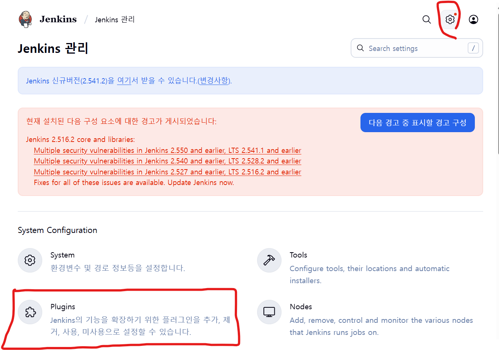

**공통 플러그인** (모든 클라우드):
```
- Kubernetes
- Pipeline Utility Steps
- Docker Pipeline
- GitHub
- Blue Ocean
- SonarQube Scanner
```

**클라우드별 추가 플러그인** (선택):

| 클라우드 | 추가 플러그인 | 비고 |
|---------|-------------|------|
| AWS EKS | Amazon ECR | ECR 토큰 자동 갱신에 유용 (선택, 설치 후 동작 검증 필요) |

> **참고**: CI 단계에서는 k8s 클러스터를 접근하지 않으므로    
> k8s 접근용 플러그인(Azure Credentials, Pipeline: AWS Steps, Google OAuth Credentials)은 불필요함.  
> ECR 토큰 자동 갱신이 필요 없다면  
> 클라우드별 추가 플러그인 없이 공통 플러그인만으로 충분함.

검색바에 위 플러그인을 검색하여 추가한 후 한꺼번에 설치.
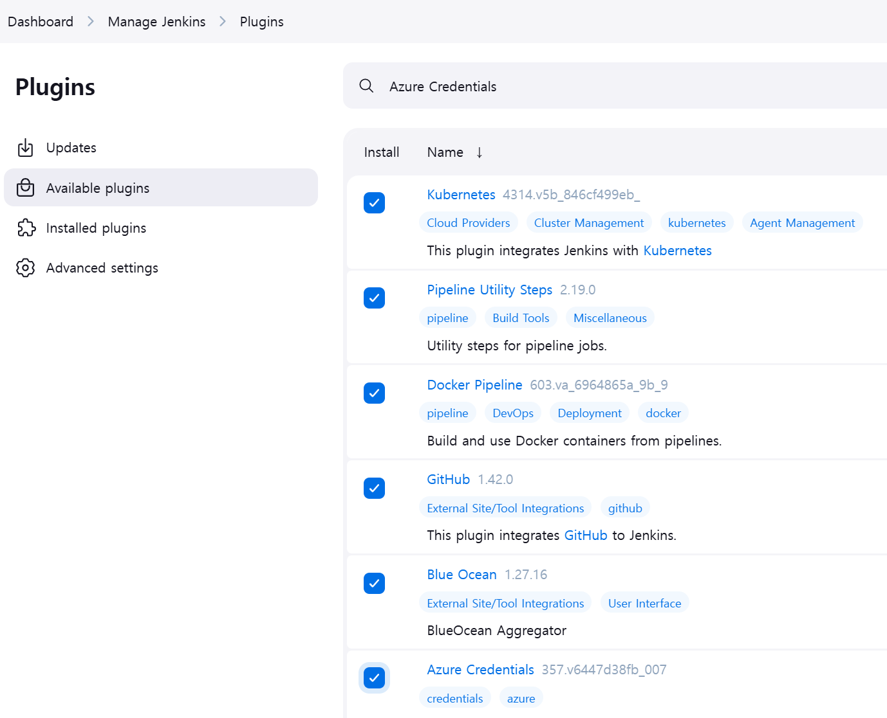


설치가 끝나면 자동으로 재시작됨.  
설치가 모두 끝났는데도 자동으로 재시작이 안 되면  
3~4분 정도 기다렸다가 전체화면을 리프레시.
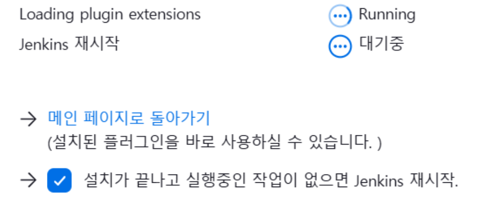

| [Top](#목차) |

---

### Kubernetes Cloud 연결

'Dashboard > Manage Jenkins'메뉴에서 'Clouds'를 선택하고, 새로운 Cloud 프로파일을 작성함.  
아래 항목의 값만 입력함.
```
- Kubernetes URL: https://kubernetes.default
- Kubernetes Namespace: jenkins
- Jenkins URL: http://jenkins
- Jenkins tunnel: jenkins-agent-listener:50000
```

System Configurations > Clouds 선택
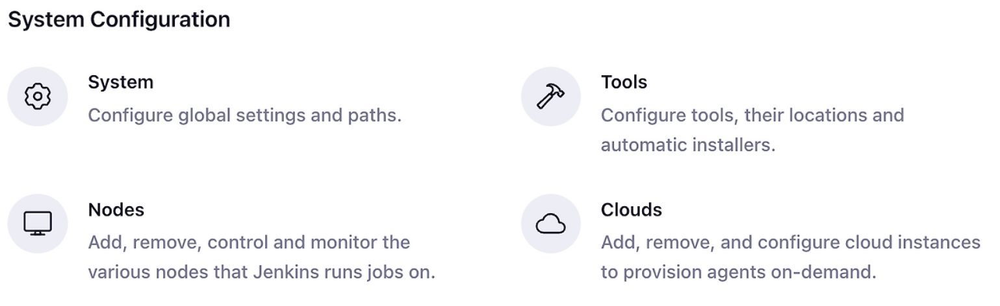

Cloud name은 아무거나 입력. k8s cloud 이름과 동일하게 하는것이 관리상 좋음
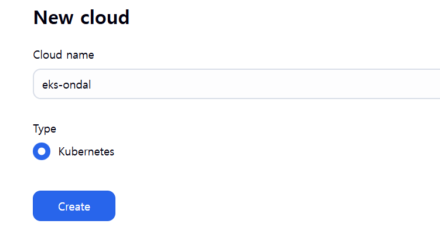

Kubernetes URL과 Kubernetes Namespace를 그림과 같이 입력
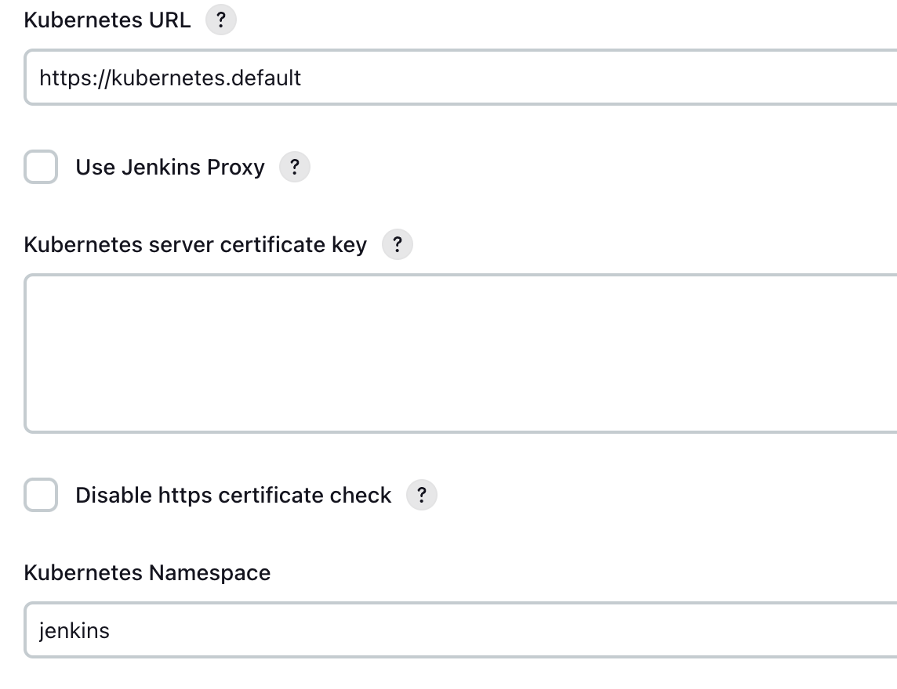

Jenkins URL과 Jenkins tunnel을 그림과 같이 입력
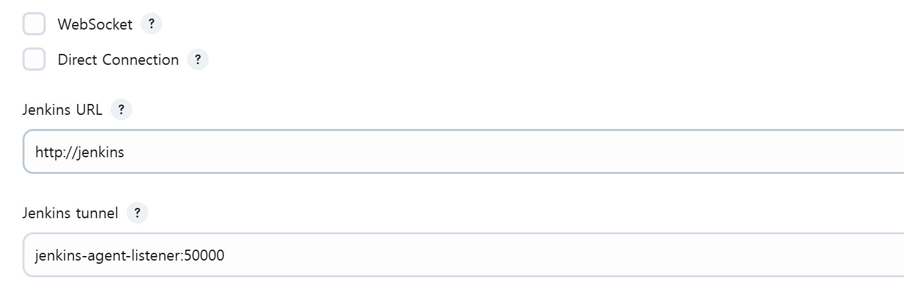

하단 우측에 있는 '[Test Connection]'버튼을 클릭하여 연결 확인.

Jenkins URL과 Jenkins tunnel을 정확히 지정함.  
참고로 Jenkins URL과 Jenkins tunnel은 Service 오브젝트의 주소임.
```
k get svc
NAME                     TYPE        CLUSTER-IP    EXTERNAL-IP   PORT(S)          AGE
jenkins                  ClusterIP   10.0.120.3    <none>        80/TCP,443/TCP   15m
jenkins-agent-listener   ClusterIP   10.0.61.235   <none>        50000/TCP        15m
```
프로파일을 저장함.

| [Top](#목차) |

---

### tunnel 포트 설정

'Dashboard > Manage Jenkins'메뉴에서 'Security'를 선택.
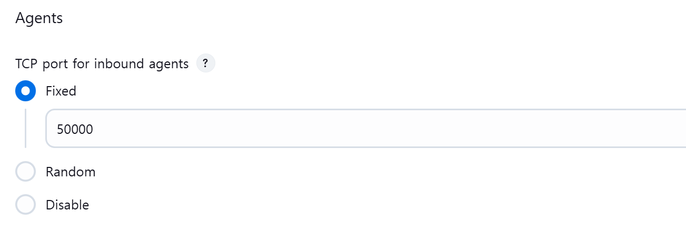

| [Top](#목차) |

---

### 계정 및 권한관리

학습 목적으로 Jenkins를 사용한다면 admin user만 있으면 되므로 이 작업은 필요 없음.  
하지만 실무에 사용하려면 계정과 권한관리는 반드시 필요함.  
아래 링크 참조.  
https://happycloud-lee.tistory.com/48

| [Top](#목차) |

---

## SonarQube 수동 설정

브라우저에서 `http://mysonar.io`로 접근.  
지정한 ID(admin)와 초기 암호(sonarP@ssword$)로 로그인.

### User Token 발급

MyAccount > Security에서 User Token발급
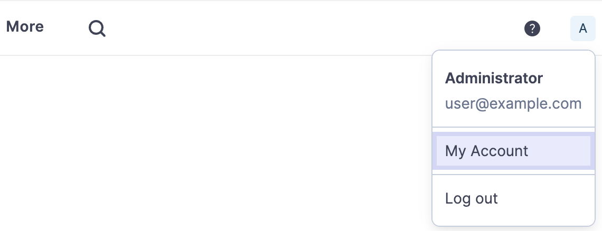
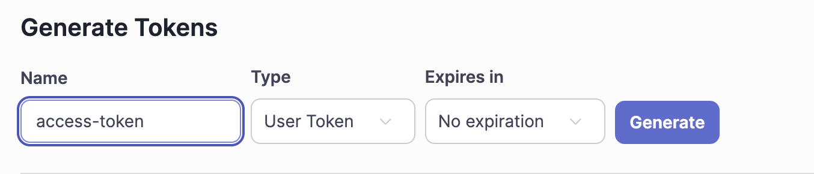


생성된 토큰값을 클립보드에 복사.

| [Top](#목차) |

---

### Jenkins Webhook 작성

SonarQube 품질 검사 결과를 Jenkins로 보내기 위해 Webhook을 만듦.
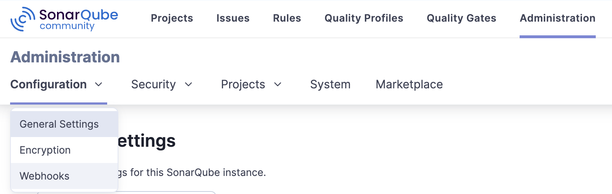

- name: 적절히 지정. 예) jenkins-webhook.
- url: Jenkins 서버의 주소
  Jenkins를 k8s에 설치한 경우 http://jenkins.jenkins.svc.cluster.local/sonarqube-webhook/ 으로 하고,  
  그냥 설치한 경우는 http://{IP 또는 host}/sonarqube-webhook/ 으로 함  
  (주의) 맨 마지막에 '/'를 반드시 입력 필요

  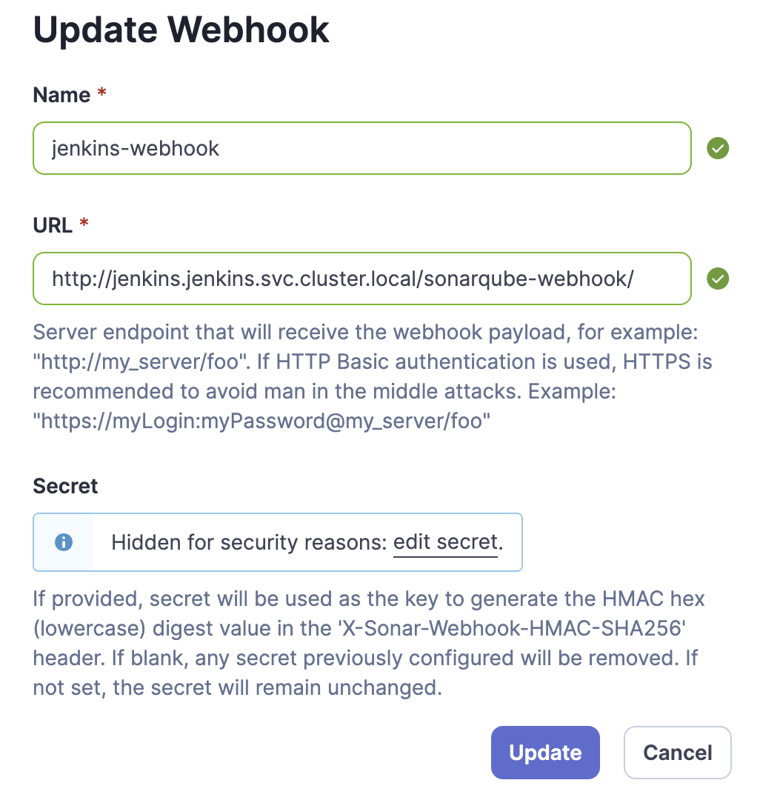

| [Top](#목차) |

---

### Quality Gate 작성

SonarQube의 Quality Gate 복사하여 Custom 만들고 New code의 code coverage를 조정함.
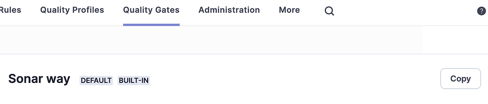

'Sonar way'선택 후 우측 상단에서 '[Copy]'버튼 클릭
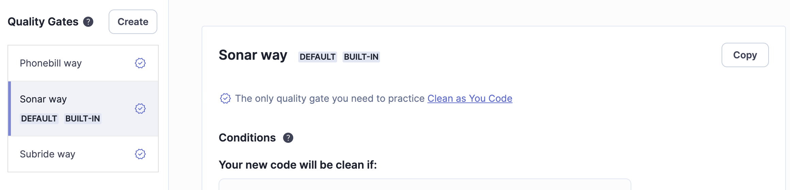

적절한 이름을 부여함.
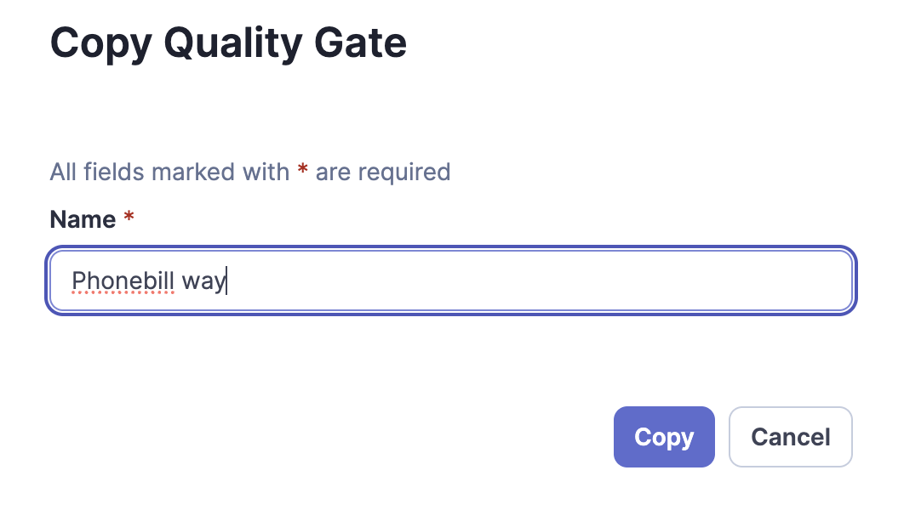

작성한 Quality Gate를 선택하고 Code Coverage를 조정함.
실습에서는 테스트 코드가 없는 서비스도 많으므로 일단 '0'으로 함.
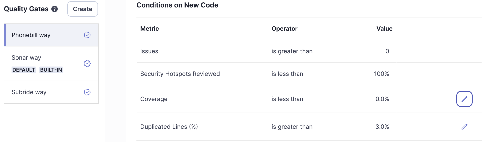

작성한 Quality Gate 선택 후 우측 상단 **Actions** > **Set as Default** 클릭하여 기본 Quality Gate로 지정함.
파이프라인에서 자동 생성되는 프로젝트가 이 Quality Gate를 자동 적용받음.

| [Top](#목차) |

---

### Jenkins에 User Token Credential 등록

Jenkins에 Credential을 위에서 만든 Token으로 만듦.  

Credentials 클릭:   
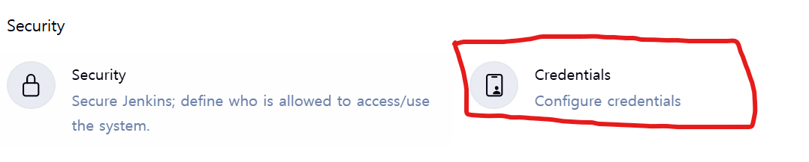     

global 클릭:  
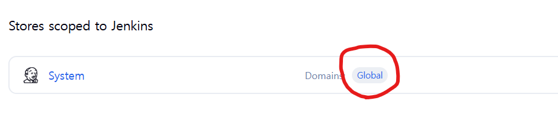  

'adding some credentials' 클릭         
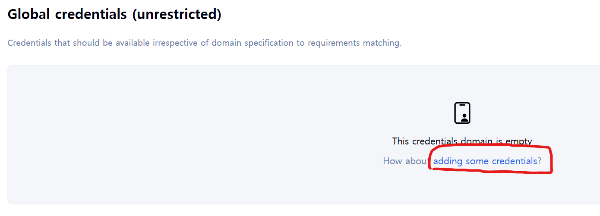    

'Secret text' 타입으로 SonarQube User Token 등록   
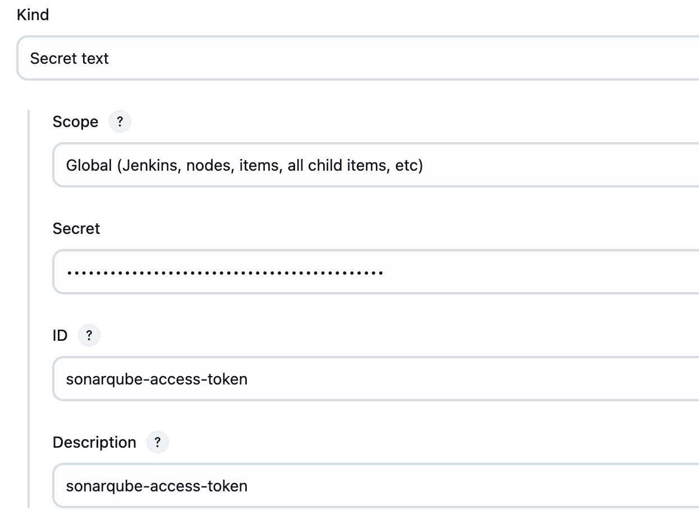

| [Top](#목차) |

---

### SonarQube Server 설정

System설정에서 SonarQube 서버 설정을 함.  
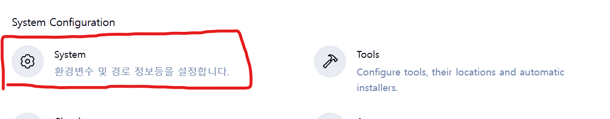   

CTRL-F로 'Sonar' 입력 하여 SonarQube 섹션을 이동 => 'Add SonarQube' 버튼 클릭   
- Name: CI/CD파이프라인에서 참조할 이름임. SonarQube로 입력 
- Server URL: Jenkins Pod에서 접근할 SonarQube 서비스의 주소. http://sonar-sonarqube.sonarqube.svc.cluster.local
- Authentication Token: 위에서 만든 credential 'sonarqube-access-token'을 선택

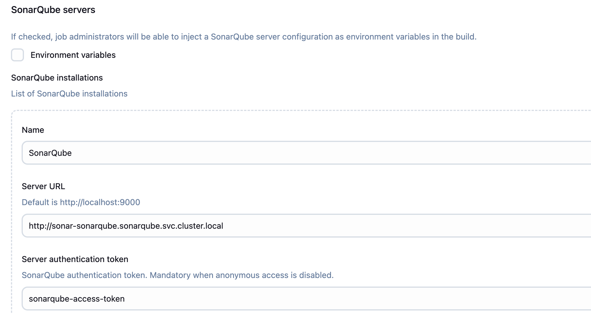

| [Top](#목차) |

---

## Image Registry Credential 설정

> CI 도구로 Jenkins를 선택한 경우에만 수행.


### [AWS EKS] ECR Credential 생성

ECR 로그인 토큰을 구함.
```
aws ecr get-login-password --region ap-northeast-2
```

Jenkins credential에 등록: 이름은 'imagereg-credentials'으로 등록
```
- Kind: Username with password
- Username: AWS
- Password: {위에서 구한 ECR 로그인 토큰}
```

> **참고**: ECR 로그인 토큰은 12시간마다 만료됨.  
> 프로덕션 환경에서는 Jenkins Pipeline에서 `ecr:getLogin` 스텝을 사용하거나,  
> `amazon-ecr-credential-helper`를 설치하여 자동 갱신 권장.

| [Top](#목차) |

---

### [Azure AKS] ACR Credential 생성

아래 명령으로 암호를 획득함.
```
az acr credential show -n {acr 이름}
```

```
az acr credential show -n unicorncr

{
  "passwords": [
    {
      "name": "password",
      "value": "{ACR_PASSWORD_1}"
    },
    {
      "name": "password2",
      "value": "{ACR_PASSWORD_2}"
    }
  ],
  "username": "{ACR_USERNAME}"
}
```

Jenkins credential에 등록: 이름은 'imagereg-credentials'으로 등록


| [Top](#목차) |

---

### [GCP GKE] Artifact Registry Credential 생성

GCP Console에서 Artifact Registry 접근용 Service Account를 생성함.  
1. Service Account 생성
2. Role 부여: **Artifact Registry 관리자** (Kubernetes Engine 역할은 불필요)
3. JSON Key 다운로드

Jenkins credential에 등록: 이름은 'imagereg-credentials'으로 등록
```
- Kind: Username with password
- Username: _json_key
- Password: {Service Account JSON Key 내용 전체}
```

| [Top](#목차) |

---

## DockerHub Credentials 생성

> CI 도구로 Jenkins를 선택한 경우에만 수행.

Pipeline 실행 시 DockerHub에서도 이미지를 내려 받기 때문에 인증정보를 등록 필요.  
public image는 인증 없이도 내려받을 수 있으나 횟수에 제한이 있어 등록 필요.

1)Access Token생성  
DockerHub(https://hub.docker.com)에 로그인.

Account Settings를 클릭
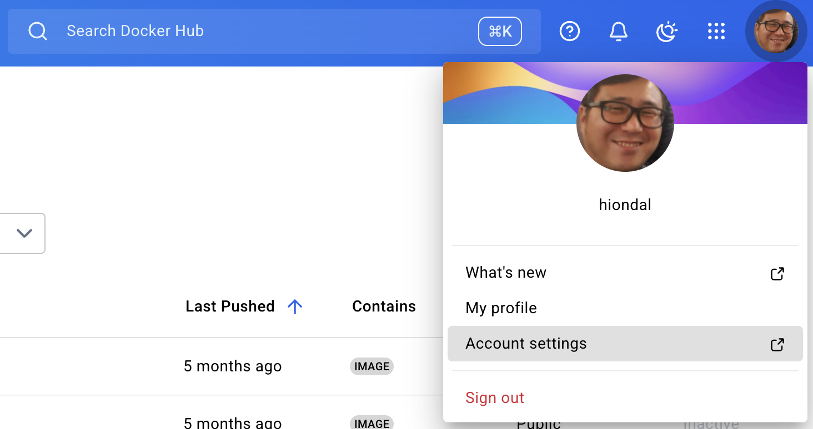

Personal Access Token을 생성함.
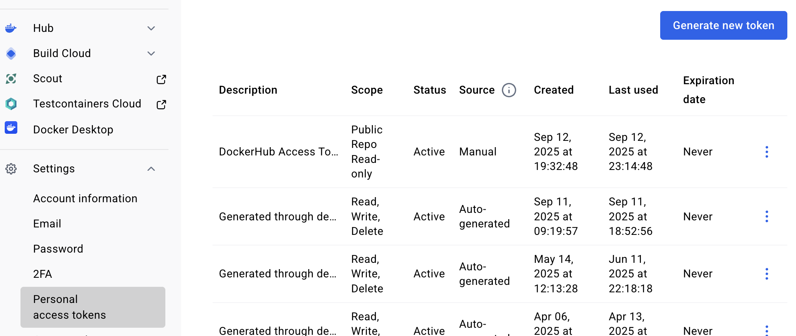

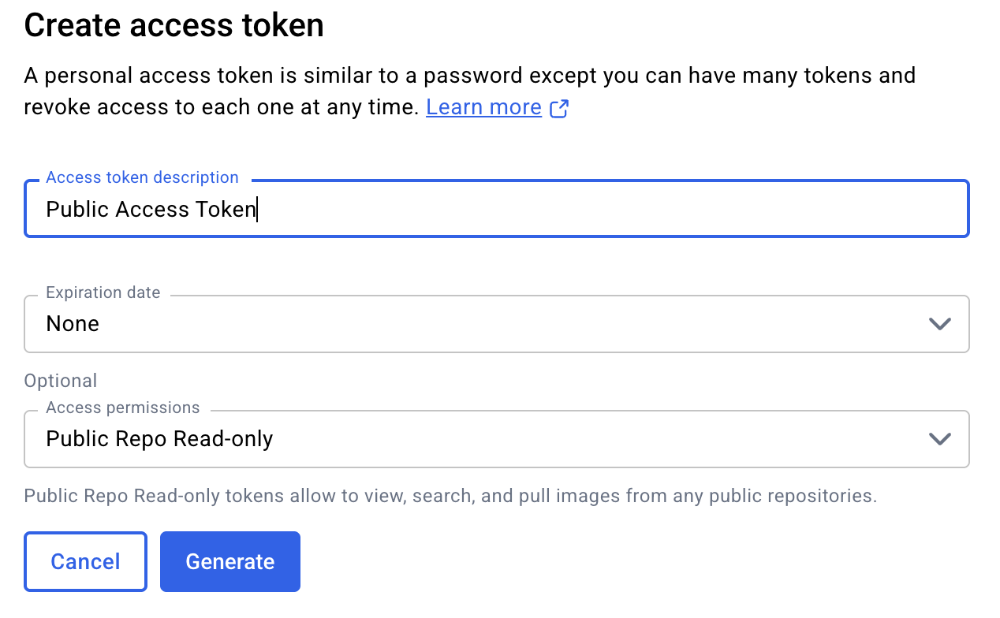

2)Jenkins Credentials 등록  
'dockerhub-credentials'라는 이름으로 등록함.  
username은 Docker Hub 로그인 id 이고 암호는 위에서 만든 토큰을 입력함.
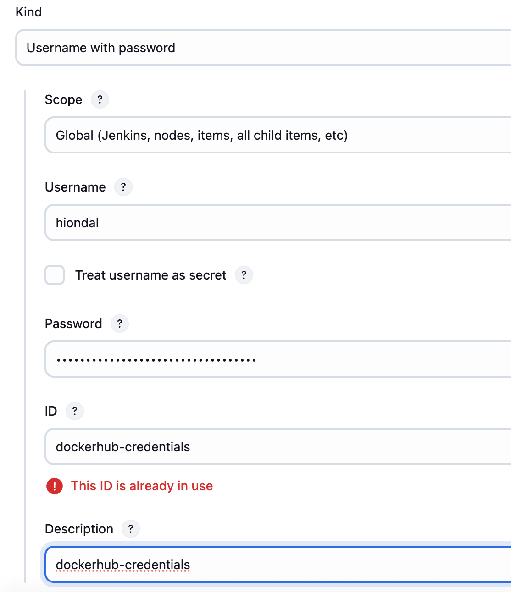

| [Top](#목차) |

---

## GitHub Webhook 설정 (Jenkins)

> CI 도구로 **Jenkins**를 선택한 경우에만 수행.
> GitHub Actions 사용자는 이 섹션을 건너뜀.

Git push 시 자동으로 Jenkins 파이프라인이 실행되도록 GitHub Repository에 Webhook을 설정함.

### Payload URL 결정

Jenkins는 Nginx 프록시 뒤에서 `default_server`로 설정되어 있으므로,
Nginx VM의 Public IP로 직접 요청하면 Jenkins로 라우팅됨.

```
GitHub → http://{VM_PUBLIC_IP}/github-webhook/
       → Nginx (Host 헤더 매칭 없음 → default_server = Jenkins)
       → proxy_set_header Host myjenkins.io
       → Ingress → Jenkins Pod
```

> Jenkins 서비스를 LoadBalancer로 별도 노출할 필요 없음.
> Nginx `default_server` 설정 덕분에 host-based 라우팅 문제가 발생하지 않음.

VM Public IP 확인:
```bash
ssh {VM_HOST} 'curl -s ifconfig.me'
```

### Webhook 등록 절차

1. GitHub Repository > **Settings** > **Webhooks** > **Add webhook**
2. 아래 정보 입력:

| 항목 | 값 |
|------|-----|
| Payload URL | `http://{VM_PUBLIC_IP}/github-webhook/` |
| Content type | `application/json` |
| Secret | (비워둠 또는 Jenkins에 설정한 Secret) |
| Which events | `Just the push event` |
| SSL verification | Disable |

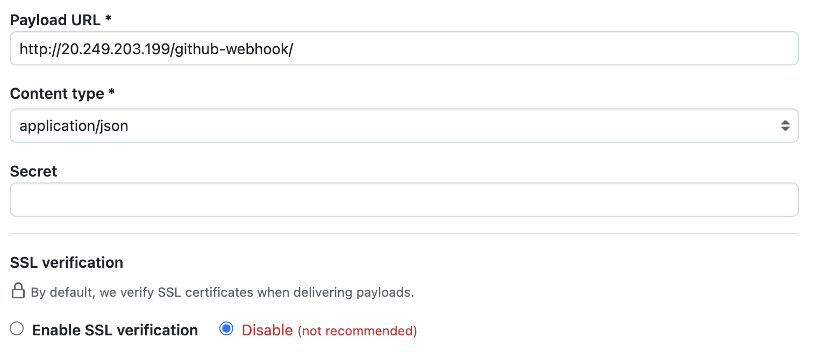 
  
3. **Add webhook** 클릭 후, Recent Deliveries 탭에서 초록색 체크 표시 확인

> 등록 직후 GitHub가 ping 이벤트를 전송함.
> 응답 코드 `200`이면 정상, `502`이면 Nginx → Ingress → Jenkins 경로를 점검.

| [Top](#목차) |

---

## GitHub Actions Repository Secrets/Variables 설정

> CI 도구로 **GitHub Actions**를 선택한 경우에만 수행.  
> Jenkins 사용자는 이 섹션을 건너뜀.

GitHub Actions는 별도 서버 설치가 불필요하지만,  
워크플로우에서 사용할 인증정보와 변수를 GitHub Repository에 등록 필요.

**등록 위치**: Repository Settings > Secrets and variables > Actions

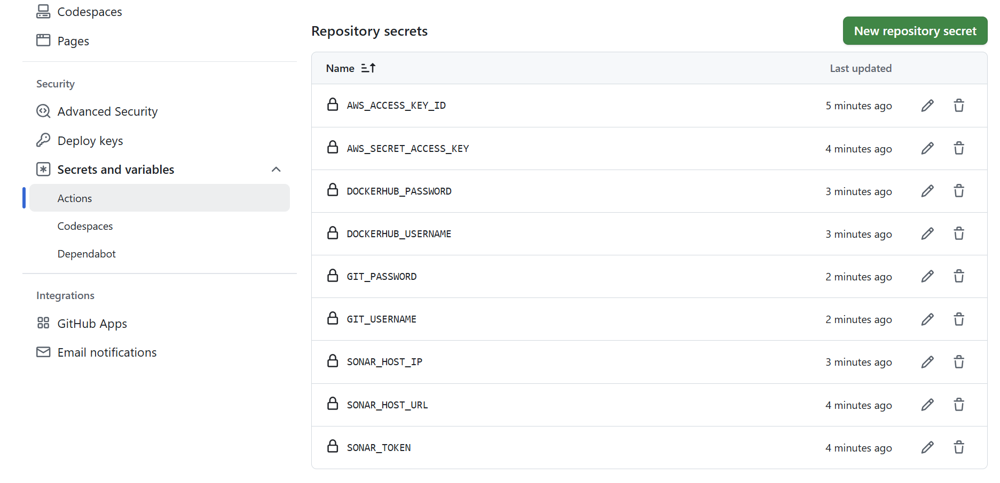 
  
### Repository Secrets (인증정보)

**레지스트리별 인증 Secrets:**

> **DockerHub** 사용 시 별도 레지스트리 인증 Secret 등록 불필요.
> 공통 Secrets의 `DOCKERHUB_USERNAME`/`DOCKERHUB_PASSWORD`만 등록하면 됨.

**ECR (AWS):**

| Secret 이름 | 값 | 확인 명령 |
|-----------|-----|----------|
| `AWS_ACCESS_KEY_ID` | AWS 액세스 키 ID | `aws configure get aws_access_key_id` |
| `AWS_SECRET_ACCESS_KEY` | AWS 시크릿 액세스 키 | `aws configure get aws_secret_access_key` |

**ACR (Azure):**

| Secret 이름 | 값 | 확인 명령 |
|-----------|-----|----------|
| `ACR_USERNAME` | ACR 관리자 사용자명 | `az acr credential show -n {ACR명} --query username -o tsv` |
| `ACR_PASSWORD` | ACR 관리자 패스워드 | `az acr credential show -n {ACR명} --query "passwords[0].value" -o tsv` |

**Google Artifact Registry (GCP):**

| Secret 이름 | 값 | 확인 명령 |
|-----------|-----|----------|
| `GCP_SA_KEY` | GCP 서비스 계정 키 JSON | 아래 참조 |

> Artifact Registry Writer 역할이 부여된 서비스 계정이 필요.
> ```bash
> # 1) SA 생성 (없는 경우)
> gcloud iam service-accounts create cicd-sa --display-name="CI/CD SA" --project={GCR_PROJECT}
> # 2) 역할 부여
> gcloud projects add-iam-policy-binding {GCR_PROJECT} \
>   --member="serviceAccount:cicd-sa@{GCR_PROJECT}.iam.gserviceaccount.com" \
>   --role="roles/artifactregistry.writer"
> # 3) 키 생성
> gcloud iam service-accounts keys create gcp-sa-key.json \
>   --iam-account=cicd-sa@{GCR_PROJECT}.iam.gserviceaccount.com
> # 4) JSON 내용을 GitHub Secret에 등록
> cat gcp-sa-key.json
> ```

**공통 Secrets:**

| Secret 이름 | 값 | 용도 |
|-----------|-----|------|
| `SONAR_TOKEN` | SonarQube 사용자 토큰 | 코드 품질 분석 |
| `SONAR_HOST_URL` | SonarQube 서버 URL (예: `http://mysonar.io`) | 코드 품질 분석 |
| `SONAR_HOST_IP` | Nginx VM의 Public IP (예: `20.249.187.69`) | SonarQube hosts 엔트리 등록 |
| `DOCKERHUB_USERNAME` | Docker Hub 사용자명 | Rate Limit 해결 |
| `DOCKERHUB_PASSWORD` | Docker Hub Personal Access Token | Rate Limit 해결 |
| `GIT_USERNAME` | 매니페스트 레포지토리 접근용 GitHub 사용자명 | ArgoCD GitOps |
| `GIT_PASSWORD` | 매니페스트 레포지토리 접근용 GitHub Token | ArgoCD GitOps |

> SONAR_HOST_URL에 DNS에 없는 'http://mysonar.io'을 등록할 수 있는 이유    
> GitHub Actions Workflow에서 hosts에 mysonar.io를 등록하는 절차가 있기 때문에 가능   
  
> **참고**: `GIT_USERNAME`/`GIT_PASSWORD`는 기본 이름임.  
> 다른 이름을 사용하려면 워크플로우 YAML의  
> `secrets.GIT_USERNAME`/`secrets.GIT_PASSWORD` 참조를 해당 이름으로 변경 필요.

| [Top](#목차) |

---

### Repository Variables (워크플로우 제어)
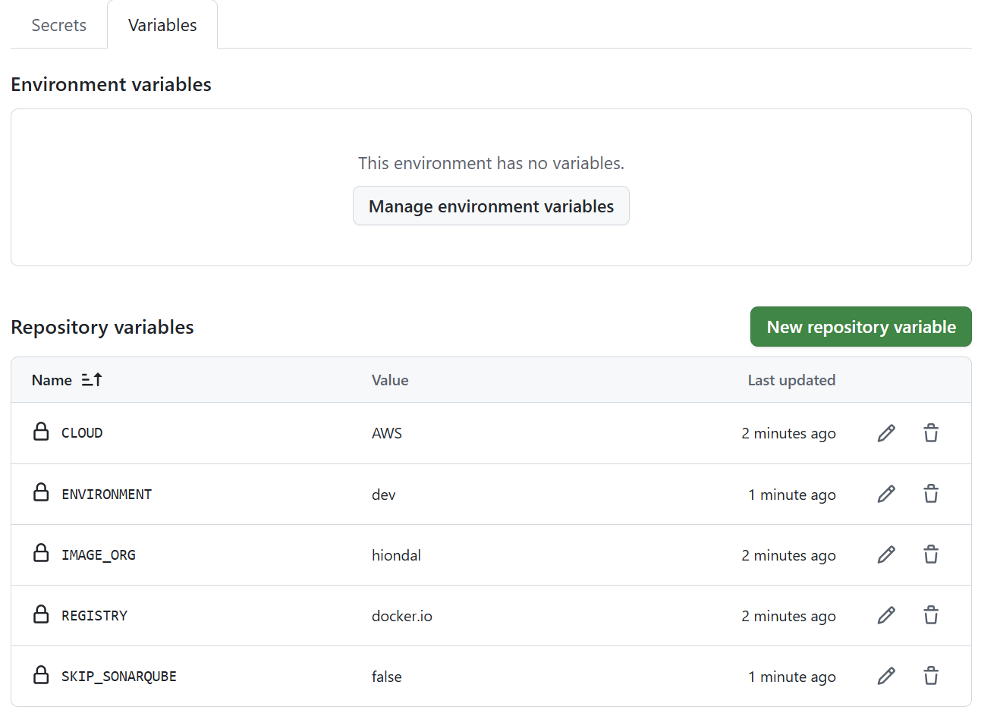 
  
| Variable 이름 | 값 예시 | 설명 |
|-------------|--------|------|
| `CLOUD` | `Azure` | 클라우드 서비스 (AWS/Azure/GCP) |
| `REGISTRY` | `acrdigitalgarage01.azurecr.io` | 컨테이너 이미지 레지스트리 주소 |
| `IMAGE_ORG` | `phonebill` | 이미지 조직명 |
| `ENVIRONMENT` | `dev` | 기본 배포 환경 (dev/staging/prod) |
| `SKIP_SONARQUBE` | `true` | SonarQube 분석 스킵 여부 |

| [Top](#목차) |

---
